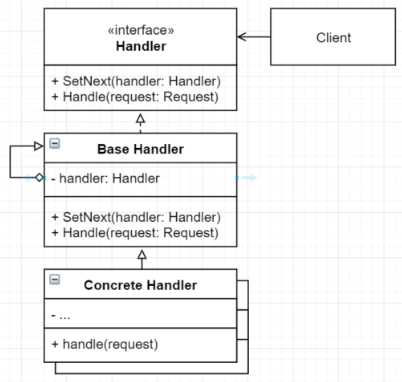
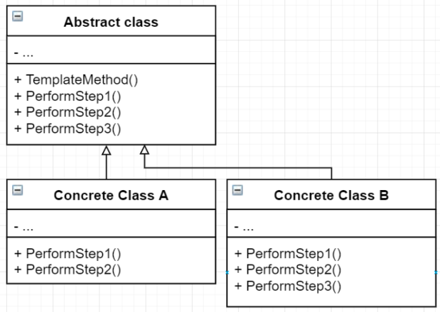
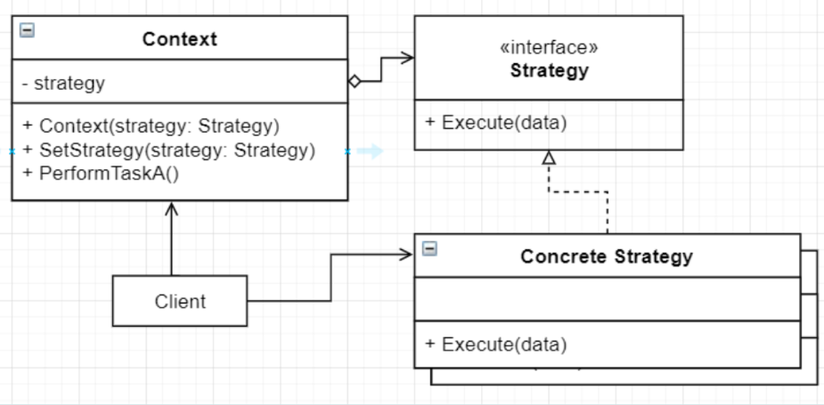

# Obrasci ponašanja
Obrasci ponašanja su obrasci koji brinu o algoritmima i dužnostima među objektima.

- Lanac odgovornosti
- Iterator
- Metoda predložak
- Strategija
- Memento
- Observer - Promatrač
- Visitor - Posjetitelj
- null objekt
- Naredba-
- Mediator-
- Stanje-

## Lanac odgovornosti

### Dijagram


### Definicija
Lanac odgovornosti je obrazac ponašanja koji omogućuje obradu zahtjeva kroz lanac rukovatelja. Pri primitku zahtjeva svaki rukovatelj obrađuje zahtjev ili ga prosljeđuje dalje kroz lanac

### Primjer
Kako primjeniti lanac odgovornosti na dani kod
```cs
public class GameEvent
    {
        public string EventType { get; set; }

        public GameEvent(string eventType)
        {
            EventType = eventType;
        }
    }

    public interface IEventHandler
    {
        public void HandleEvent(GameEvent gameEvent);
    }

    class KeyboardHandler
    {
        public void HandleEvent(GameEvent gameEvent)
        {
            Console.WriteLine("KeyboardHandler handled KeyPress event");
        }
    }

    class MouseHandler : IEventHandler
    {
        public void HandleEvent(GameEvent gameEvent)
        {
            Console.WriteLine("MouseHandler handled MouseClick event");
        }
    }

    class CollisionHandler : IEventHandler
    {
        public void HandleEvent(GameEvent gameEvent)
        {
            Console.WriteLine("CollisionHandler handled Collision event");
        }
    }

    public class Game
    {
        public Game()
        {
            GameEvent gameEvent = new GameEvent("Collision");

            if (gameEvent.EventType == "Collision")
            {
                new CollisionHandler().HandleEvent(gameEvent);
            }
            else if (gameEvent.EventType == "KeyPress")
            {
                new KeyboardHandler().HandleEvent(gameEvent);
            }
            else if (gameEvent.EventType == "MouseClick")
            {
                new MouseHandler().HandleEvent(gameEvent);
            }
        }
    }
```
Rješenje:
```c#
 public class GameEvent
    {
        public string EventType { get; set; }

        public GameEvent(string eventType)
        {
            EventType = eventType;
        }
    }

    public interface IEventHandler
    {
        public void SetSuccessor(IEventHandler eventHandler);
        public void HandleEvent(GameEvent gameEvent);
    }

    public class BaseHandler : IEventHandler
    {
        protected IEventHandler successor;
        private IEventHandler last;
        public virtual void HandleEvent(GameEvent gameEvent)
        {
            if (successor != null)
            {
                successor.HandleEvent(gameEvent);
            }
        }

        public void SetSuccessor(IEventHandler eventHandler)
        {
            if (successor == null)
            {
                successor = eventHandler;
                last = successor;
            }
            else
            {
                last.SetSuccessor(eventHandler);
                last = eventHandler;
            }
        }
    }

    class KeyboardHandler : BaseHandler
    {
        public override void HandleEvent(GameEvent gameEvent)
        {
            if (gameEvent.EventType == "KeyPress")
            {
                Console.WriteLine("KeyboardHandler handled KeyPress event");
            }
            else
            {
                Console.WriteLine("KeyboardHandler passed the event to the next handler");
                successor.HandleEvent(gameEvent);
            }
        }
    }

    class MouseHandler : BaseHandler
    {
        public override void HandleEvent(GameEvent gameEvent)
        {
            if (gameEvent.EventType == "MouseClick")
            {
                Console.WriteLine("MouseHandler handled MouseClick event");
            }
            else
            {
                Console.WriteLine("MouseHandler passed the event to the next handler");
                successor.HandleEvent(gameEvent);
            }
        }
    }

    class CollisionHandler : BaseHandler
    {
        public override void HandleEvent(GameEvent gameEvent)
        {
            if (gameEvent.EventType == "Collision")
            {
                Console.WriteLine("CollisionHandler handled Collision event");
            }
            else
            {
                Console.WriteLine("CollisionHandler cannot handle this event");
                successor.HandleEvent(gameEvent);
            }
        }
    }

    public class Game
    {
        public Game()
        {
            // Creating event handlers
            IEventHandler keyboardHandler = new KeyboardHandler();

            IEventHandler mouseHandler = new MouseHandler();
            IEventHandler collisionHandler = new CollisionHandler();
            IEventHandler baseHandler = new BaseHandler();

            baseHandler.SetSuccessor(keyboardHandler);
            baseHandler.SetSuccessor(mouseHandler);
            baseHandler.SetSuccessor(collisionHandler);

            baseHandler.HandleEvent(new GameEvent("Collision"));
        }
    }
```
### Poveži klase i metode s ulogama u obrascu
Zadatak:
|Generic                    | Contextual                |
|:--------------------------|:--------------------------|  
|Game                       | Request                   |
|BaseHandler                | Handler                   |
|CollisionHandler           | BaseHandler               |
|IEventHandler              | SetNext                   |
|SetSuccessor               | Handle                    |
|HandleEvent                | ConcreteHandler           |
|GameEvent                  | Client                    |

### Koja solid načela vidimo
- SRP - Svaka klasa brine o svome tipu eventa, nije sve u jednoj klasi
- OCP - Možemo dodavati jos handlera bez da mijenjamo klijentski kod
- LSP - Base handler i Concrete handler su medjusobno zamjenjivi
- ISP - sučelje nameće samo metode bitne za handler
- DIP - ovisimo o IEventHandler apstrakciji

### Povezani obrasci
- BaseHandler moze biti Singleton
- Lanac i observer daju razlicite nacine obavljanja zahtjeva
- Lanac i kompozit mogu biti koristeni zajedno
- Ovisi o rekurzivnoj kompoziciji kao i Dekorater i Kompozit

### Koraci implementacije
1. Deklarirati sučelje koje predstavlja obrađivača

2. S ciljem smanjenja dupliciranja koda kreirati osnovnu klasu obrađivača, ugraditi mogućnost pohrane reference na sljedećeg obrađivača (referenca na apstrakciju)

3. Konkretan obrađivač implementira metode za obradu, a nasljeđuje osnovnu klasu

4. Klijent ili sam konstruira lanac ili prima već gotov, daje zahtjev određenom rukovatelju na obradu

### Kada koristiti
- Kada program ima nekoliko različitih načina za obraditi zahtjev, ali nije unaprijed poznato kakav će se zahtjev pojaviti u sustavu

- Kada je važno provesti obradu zahtjeva određenim redoslijedom

- Kada objekti obrađuju zahtjeve, a njihov bi se redoslijed trebao moći mijenjati dinamički, tijekom izvođenja

### Posljedice
#### Pozitivne:
- Smanjuje ovisnost među pošiljatelja zahtjeva i obradivacima istih
- Pojednostavljuje povezanost među objektima
- SRP
- OCP
#### Negativne:
- Neki zahtjevi nece biti obrađeni

## Iterator

### Dijagram


### Definicija
Iterator je obrazac ponasanja koji omogucuje prolazak kroz kolekcije elemenata bez da klijent zna kako (lista, stog, stablo…)
### Primjer
Stvori iterator za danu klasu:
```cs
public class Item
{
    public string name;

    public Item(string name)
    {
        this.name = name;
    }
}
```
Rješenje:
```cs
 public class Item
    {
        public string name;

        public Item(string name)
        {
            this.name = name;
        }
    }

    public interface IItemIterator
    {
        public bool HasNext();
        public Item GetNext();
    }

    public interface IItemCollection
    {
        public IItemIterator CreateItemIterator();
    }

    public class ItemIterator : IItemIterator
    {
        private ItemCollection itemCollection;
        int current;

        public ItemIterator(ItemCollection itemCollection)
        {
            this.itemCollection = itemCollection;
        }

        public Item GetNext()
        {
            if (HasNext())
            {
                Item item = itemCollection.GetItem(current);
                current++;
                return item;
            }
            else
            {
                throw new Exception("Nema");
            }
        }

        public bool HasNext()
        {
            return current <= itemCollection.Count();
        }
    }

    public class ItemCollection : IItemCollection
    {
        private List<Item> items;

        public ItemCollection(List<Item> items)
        {
            this.items = items;
        }

        public IItemIterator CreateItemIterator()
        {
            return new ItemIterator(this);
        }

        public int Count()
        {
            return items.Count;
        }

        public Item GetItem(int index)
        {
            return items[index];
        }
    }
```
### Poveži klase i metode s ulogama u obrascu
|Generic                    | Contextual                |
|:--------------------------|:--------------------------|  
|Client                     | ItemCollection            |
|Iterator                   | HasNext                   |
|Iterable Collection        | GetNext                   |
|Concrete Iterator          | IItemIterator             |    
|Concrete Collection        | IItemCollection           |
|GetNext                    | Item                      |
|collection                 | Client                    |
|HasNext                    | items                     |

### Koja solid načela vidimo
- SRP - posao dijelimo na iterator i kolekciju
- OCP - mozemo dodavati iteratore i kolekcije zbog apstrakcija o kojim ovise
- LSP - iteratori su medjusobno zamjenjivi sa drugim iteratorima i kolekcije sa kolekcijama
- ISP-Iterator i IteratorCollection imaju odvojena sucelja
- DIP - iterator i kolekcija ovise o apstrakcijama

### Koraci implementacije
1. Definiraj sučelja operatora; mora imati barem GetNext() no zbog jednostavnijeg koristenja dobro je dodati dodatne metode ako HasNext():bool
2. Implementiranje sučelja u konkretan iterator. Konkretan iterator treba imati referencu na jednu instancu kolekcije
3. Definiraj sučelje kolekcije: Treba minimalno imat metodu koja stvara Iterator. Pri stvaranju iteratora kolekcija predaje instancu sebe iteratoru
4. U klijentskom kodu implementiraj prolaženje kroz kolekciju pomoću Iteratora

### Kada koristiti
- Koristi kad kolekcija ima kompleksnu strukturu podataka iza sebe i želiš sakriti tu kompleksnost of klijenata.
- Koristi obrazac za smanjivanje duplikacije kod koji prolazi kroz kolekciju
- Koristi iterator kad zelis da kod može prolaziti kroz različite strukture podataka ili kad su te strukture unaprijed ne poznate.

### Posljedice
- SRP - algoritme prolaženja odvajas od klijentskog koda
- OCP- možeš dodavati različite vrste iteratora
- Mozes prolaziti kroz istu kolekciju paralelno jer svaki iterator sadrži svoja stanja iteratora
- Mozes kontrolirati iteraciju, zaustaviti i započeti kad je potrebno
- Implementiranje je overkill kad aplikacija radi sa jednostavnim kolekcijama
- Može biti nešto manje efikasan od direktnog pristupa prolaženja kroz komponente

## Metoda predložak
### Dijagram


### Definicija
Metoda predložak je obrazac ponasanje koji definirat kostur algoritma  u superklasi ali dozvoljava podklasama do prepisu specifične korake algoritma bez mijenjanja strukture

### Primjer
Primjeni metodu predložak na dani kod:
```cs
 public class Game
    {
        public Game()
        {
            Console.WriteLine("Start Game");
            Console.WriteLine("Spawn Enemy");
            Console.WriteLine("Spawn a Player");
            Console.WriteLine("End Game");
        }
    }
    public class GameManager
    {
        Game game;
        public GameManager(Game game)
        {
            this.game = game;
        }
    }
```
Rješenje:
```cs
    public abstract class Game
    {
        public void Play()
        {
            StartGame();
            SpawnEnemies();
            SpawnAPlayer();
            EndGame();
        }
        public void StartGame()
        {
            Console.WriteLine("Start Game");
        }
        public abstract void SpawnEnemies();
        public abstract void SpawnAPlayer();
        public virtual void EndGame()
        {
            Console.WriteLine("End Game");
        }
    }

    public class Multiplayer : Game
    {
        public override void SpawnAPlayer()
        {
            Console.WriteLine("Spawn a bunch of Players");
        }

        public override void SpawnEnemies()
        {
            Console.WriteLine("Spawn a bunch of Enemies");
        }
    }

    public class ZombieGame : Game
    {
        public override void SpawnAPlayer()
        {
            Console.WriteLine("Spawn a Player");
        }

        public override void SpawnEnemies()
        {
            Console.WriteLine("Spawn 5 Zombies");
        }
    }

    public class GameManager
    {
        Game game;
        public GameManager(Game game)
        {
            this.game = game;
            game.Play();
        }
    }
```
### Poveži klase i metode s ulogama u obrascu
|Generic                    | Contextual                |
|:--------------------------|:--------------------------|  
|Game                       | PerformStep               |
|GameManager                | Concrete Class B          |
|ZombieGame                 | Abstract class            |
|Multiplayer                | Concrete Class A          |
|StartGame                  | PerformStep               |
|EndGame                    | Client                    |

### Koja solid načela vidimo
- SRP - svaka metoda se brine za svoj dio funkcionalnosti
- OCP - mozemo dodavat jos tipova klase Game
- LSP - klase izvedene iz apstraktne klase su međusobno zamjenjive
- DIP - ovise o apstraktnoj klasi

### Povezani obrasci
- Metoda tvornica je specijalizacije Metode predložak
- Predlozak metoda koristi nasljedivanje a strategiji kompoziciju

### Koraci implementacije
1. Analiziraj algoritam i vidi može li se raspodijeliti u korake
2. Stvori apstraktnu klasu koja sadrže originalni algoritam raspodijeljen u apstraktne metode i implementaciju metode predložak
3. Metoda predložak koristi korake koji su definirani kao apstraktne metode
4. Neki koraci mogu imati i implementaciju ako problem to zahtijeva
Za svaku varijaciju algoritma stvori novu konkretnu podklasu koja mora implementirati apstraktne korake tj. metode
5. Ako je potrebno mozes prepisati i opcionalne

### Kada koristiti
- Koristi Metodu predložak kad zelis dati klijentima mogućnost definiranja određenih koraka algoritma ali ne cijeli algoritam ili njegovu strukturu
- Koristi obrazac kad imas vise klasa koji sadrže skoro identične algoritme sa manjim razlikama. 

### Posljedice
#### Pozitivne
- Klijent može propisati samo određene dijelove većeg algoritma.
- Mozes ponavljajuci kod staviti u super klasu

#### Negativne
- Klijent je ograničen kosturom algoritma
- Mozes krstiti Liskov Princip prepisivanjem postojećih implementacija u podklasi
- Sto vise koraka kostur predloška sadrzi to je teže održavanje

## Strategija
### Dijagram


### Definicija
Strategija je obrazac ponašanja koji omogućuje definiciju obitelji algoritama tako sto algoritme stavlja u odvojene klase koje implementiraju isto sučelje i na taj nacin ih cini medjusobno zamjenjivima

### Primjer
Primjeni strategiju na dani kod:
```cs
public class Enemy
{
    int x;
    int y;

    public Enemy(int x, int y)
    {
        this.x = x;
        this.y = y;
    }

    public void Spawn()
    {
        Console.WriteLine($"Spawn at {x} {y}");
    }
}

public class Game
{
    string spawnWay;
    public Game(string spawnWay, int n)
    {
        this.spawnWay = spawnable;
        Spawn(n);
    }

    public void SetSpawnWay(string spawnWay)
    {
        this.spawnWay = spawnWay;
    }

    public void Spawn(int n)
    {
        switch(spawnWay){
            case "random":
                Random random = new Random();
                for (int i = 0; i < n; i++)
                {
                    new Enemy(random.Next(-100, 100), random.Next(-100, 100));
                }
            break;

            case "diagonal":
                for (int i = 0; i < n; i++)
                {
                    new Enemy(i, i);
                }
            break;

            case "spot":
                for (int i = 0; i < n; i++)
                {
                    new Enemy(0, 0);
                }
            break;

        }
    }
}
```
Rješenje:
```cs
public class Enemy
{
    int x;
    int y;

    public Enemy(int x, int y)
    {
        this.x = x;
        this.y = y;
    }

    public void Spawn()
    {
        Console.WriteLine($"Spawn at {x} {y}");
    }
}

public interface ISpawnable
{
    public void Spawn(int n);
}

public class RandomSpawn : ISpawnable
{
    public void Spawn(int n)
    {
        Random random = new Random();
        for (int i = 0; i < n; i++)
        {
            new Enemy(random.Next(-100, 100), random.Next(-100, 100));
        }
    }
}

public class DiagonalSpawn : ISpawnable
{
    public void Spawn(int n)
    {
        for (int i = 0; i < n; i++)
        {
            new Enemy(i, i);
        }
    }
}

public class SpotSpawn : ISpawnable
{
    public void Spawn(int n)
    {
        for (int i = 0; i < n; i++)
        {
            new Enemy(0, 0);
        }
    }
}

public class Game
{
    ISpawnable spawnable;
    public Game(ISpawnable spawnable, int n)
    {
        this.spawnable = spawnable;
        Spawn(n);
    }

    public void SetSpawnWay(ISpawnable spawnable)
    {
        this.spawnable = spawnable;
    }

    public void Spawn(int n)
    {
        spawnable.Spawn(n);
    }
}
```
### Poveži klase i metode s ulogama u obrascu
Zadatak:
|Generic                    | Contextual                |
|:--------------------------|:--------------------------|  
|Context                    | Spawn                     |
|Strategy                   | SpotSpawn                 |
|Concrete Strategy          | DiagonalSpawn             |
|Execute                    | ISpawnWay                 |
|                           | Game                      |
### Koja SOLID načela vidimo
- SRP - svaka strategija u svoju klasi
- OCP - mozemo dodavati nove strategije bez da mjenjamo stare
- LSP - strategije su medjusobno zamjenjive
- ISP - samo stvari vezane za strategiju idu u interface
- DIP - strategija ovisi o apstrakciji

### Povezani obrasci
- Most, stanje i strategija imaju slicnu strukturu
- Dekoratorom mjenjamo vanjstinu a strategijom unutrasnjost
- Predlozak metoda koristi nasljedivanje a strategiji kompoziciju
- Stanje je prosirenje strategije

### Koraci implementacije
1. U kontekstnoj klasi identifiraj algoritam koji je podlozan ucestalog promjeni
2. Deklariraj sucelje zajednicko svim varijantama algoritma
3. Jedan po jedan izvuci algoritme u odvojene klase.
4. Svaka algoritamska klasa treba implementirati definirano sučelje
5. U kontekstnoj klasi definiraj referencu na sucelje strategije. Dodaj setter za mijenjanje vrijednosti tog polja.
6. Klijent kontrolira strategiju kojom kontekst izvodi svoj posao

### Kada koristiti
- Kad imas vise algoritama koje zelis moci mijenjati kroz izvođenje programa (during runtime)
- Kad imas vise slicnih klasa kojima je razlika u tome kako ostvaruju funkcionalnost
- Za izoliranje poslovne logike od detalja
- Kad imas ogromni switch case ili if else u sustavu koji sadrzi vise algoritama u sebi

### Posljedice
#### Pozitivne
- Mozes mijenjati algoritme kroz izvođenje programa
- Izolacija implementacije od koda koji je koristi
- Mozes mijenjati nasljeđivanje kompozicijom
- OCP
#### Negativne	               
- Ako imas nekoliko algoritama koji se rijetko mijenjaju nema razloga uvoditi strategiju iako ima smisla
- Klijent mora biti svjestan razlika među strategijama kako bi ih mogao pravilno koristiti
- Novi jezici omogućavaju implementiranje različitih verzija algoritama unutar funkcija (JS) sto ubiti poništava potrebu za strategijom u nekim slučajevima


## Memento
### Dijagram
### Definicija
### Primjer
### Poveži klase i metode s ulogama u obrascu
### Koja solid načela vidimo
### Povezani obrasci
### Koraci implementacije
### Kada koristiti
### Posljedice

## Promatrač (engl. Observer)
### Dijagram
### Definicija
### Primjer
### Poveži klase i metode s ulogama u obrascu
### Koja solid načela vidimo
### Povezani obrasci
### Koraci implementacije
### Kada koristiti
### Posljedice

## Posjetitelj (engl. Visitor)
### Dijagram
### Definicija
### Primjer
### Poveži klase i metode s ulogama u obrascu
### Koja solid načela vidimo
### Povezani obrasci
### Koraci implementacije
### Kada koristiti
### Posljedice

## null objekt
### Dijagram
### Definicija
### Primjer
### Poveži klase i metode s ulogama u obrascu
### Koja solid načela vidimo
### Povezani obrasci
### Koraci implementacije
### Kada koristiti
### Posljedice

## Naredba-
### Dijagram
### Definicija
### Primjer
### Poveži klase i metode s ulogama u obrascu
### Koja solid načela vidimo
### Povezani obrasci
### Koraci implementacije
### Kada koristiti
### Posljedice

## Mediator-
### Dijagram
### Definicija
### Primjer
### Poveži klase i metode s ulogama u obrascu
### Koja solid načela vidimo
### Povezani obrasci
### Koraci implementacije
### Kada koristiti
### Posljedice

## Stanje-
### Dijagram
### Definicija
### Primjer
### Poveži klase i metode s ulogama u obrascu
### Koja solid načela vidimo
### Povezani obrasci
### Koraci implementacije
### Kada koristiti
### Posljedice