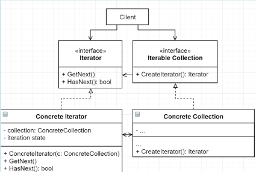

# Obrasci ponašanja
Obrasci ponašanja su obrasci koji brinu o algoritmima i dužnostima među objektima.

- Lanac odgovornosti
- Iterator
- Metoda predložak
- Strategija
- Memento
- Observer - Promatrač
- Visitor - Posjetitelj
- null objekt
- Naredba-
- Mediator-
- Stanje-

## Lanac odgovornosti

### Dijagram


### Definicija
Lanac odgovornosti je obrazac ponašanja koji omogućuje obradu zahtjeva kroz lanac rukovatelja. Pri primitku zahtjeva svaki rukovatelj obrađuje zahtjev ili ga prosljeđuje dalje kroz lanac

### Primjer
Kako primjeniti lanac odgovornosti na dani kod
```cs
public class GameEvent
    {
        public string EventType { get; set; }

        public GameEvent(string eventType)
        {
            EventType = eventType;
        }
    }

    public interface IEventHandler
    {
        public void HandleEvent(GameEvent gameEvent);
    }

    class KeyboardHandler
    {
        public void HandleEvent(GameEvent gameEvent)
        {
            Console.WriteLine("KeyboardHandler handled KeyPress event");
        }
    }

    class MouseHandler : IEventHandler
    {
        public void HandleEvent(GameEvent gameEvent)
        {
            Console.WriteLine("MouseHandler handled MouseClick event");
        }
    }

    class CollisionHandler : IEventHandler
    {
        public void HandleEvent(GameEvent gameEvent)
        {
            Console.WriteLine("CollisionHandler handled Collision event");
        }
    }

    public class Game
    {
        public Game()
        {
            GameEvent gameEvent = new GameEvent("Collision");

            if (gameEvent.EventType == "Collision")
            {
                new CollisionHandler().HandleEvent(gameEvent);
            }
            else if (gameEvent.EventType == "KeyPress")
            {
                new KeyboardHandler().HandleEvent(gameEvent);
            }
            else if (gameEvent.EventType == "MouseClick")
            {
                new MouseHandler().HandleEvent(gameEvent);
            }
        }
    }
```
Rješenje:
```c#
 public class GameEvent
    {
        public string EventType { get; set; }

        public GameEvent(string eventType)
        {
            EventType = eventType;
        }
    }

    public interface IEventHandler
    {
        public void SetSuccessor(IEventHandler eventHandler);
        public void HandleEvent(GameEvent gameEvent);
    }

    public class BaseHandler : IEventHandler
    {
        protected IEventHandler successor;
        private IEventHandler last;
        public virtual void HandleEvent(GameEvent gameEvent)
        {
            if (successor != null)
            {
                successor.HandleEvent(gameEvent);
            }
        }

        public void SetSuccessor(IEventHandler eventHandler)
        {
            if (successor == null)
            {
                successor = eventHandler;
                last = successor;
            }
            else
            {
                last.SetSuccessor(eventHandler);
                last = eventHandler;
            }
        }
    }

    class KeyboardHandler : BaseHandler
    {
        public override void HandleEvent(GameEvent gameEvent)
        {
            if (gameEvent.EventType == "KeyPress")
            {
                Console.WriteLine("KeyboardHandler handled KeyPress event");
            }
            else
            {
                Console.WriteLine("KeyboardHandler passed the event to the next handler");
                successor.HandleEvent(gameEvent);
            }
        }
    }

    class MouseHandler : BaseHandler
    {
        public override void HandleEvent(GameEvent gameEvent)
        {
            if (gameEvent.EventType == "MouseClick")
            {
                Console.WriteLine("MouseHandler handled MouseClick event");
            }
            else
            {
                Console.WriteLine("MouseHandler passed the event to the next handler");
                successor.HandleEvent(gameEvent);
            }
        }
    }

    class CollisionHandler : BaseHandler
    {
        public override void HandleEvent(GameEvent gameEvent)
        {
            if (gameEvent.EventType == "Collision")
            {
                Console.WriteLine("CollisionHandler handled Collision event");
            }
            else
            {
                Console.WriteLine("CollisionHandler cannot handle this event");
                successor.HandleEvent(gameEvent);
            }
        }
    }

    public class Game
    {
        public Game()
        {
            // Creating event handlers
            IEventHandler keyboardHandler = new KeyboardHandler();

            IEventHandler mouseHandler = new MouseHandler();
            IEventHandler collisionHandler = new CollisionHandler();
            IEventHandler baseHandler = new BaseHandler();

            baseHandler.SetSuccessor(keyboardHandler);
            baseHandler.SetSuccessor(mouseHandler);
            baseHandler.SetSuccessor(collisionHandler);

            baseHandler.HandleEvent(new GameEvent("Collision"));
        }
    }
```
### Poveži klase i metode s ulogama u obrascu
Zadatak:
|Generic                    | Contextual                |
|:--------------------------|:--------------------------|  
|Game                       | Request                   |
|BaseHandler                | Handler                   |
|CollisionHandler           | BaseHandler               |
|IEventHandler              | SetNext                   |
|SetSuccessor               | Handle                    |
|HandleEvent                | ConcreteHandler           |
|GameEvent                  | Client                    |

### Koja solid načela vidimo
- SRP - Svaka klasa brine o svome tipu eventa, nije sve u jednoj klasi
- OCP - Možemo dodavati jos handlera bez da mijenjamo klijentski kod
- LSP - Base handler i Concrete handler su medjusobno zamjenjivi
- ISP - sučelje nameće samo metode bitne za handler
- DIP - ovisimo o IEventHandler apstrakciji

### Povezani obrasci
- BaseHandler moze biti Singleton
- Lanac i observer daju razlicite nacine obavljanja zahtjeva
- Lanac i kompozit mogu biti koristeni zajedno
- Ovisi o rekurzivnoj kompoziciji kao i Dekorater i Kompozit

### Koraci implementacije
1. Deklarirati sučelje koje predstavlja obrađivača

2. S ciljem smanjenja dupliciranja koda kreirati osnovnu klasu obrađivača, ugraditi mogućnost pohrane reference na sljedećeg obrađivača (referenca na apstrakciju)

3. Konkretan obrađivač implementira metode za obradu, a nasljeđuje osnovnu klasu

4. Klijent ili sam konstruira lanac ili prima već gotov, daje zahtjev određenom rukovatelju na obradu

### Kada koristiti
- Kada program ima nekoliko različitih načina za obraditi zahtjev, ali nije unaprijed poznato kakav će se zahtjev pojaviti u sustavu

- Kada je važno provesti obradu zahtjeva određenim redoslijedom

- Kada objekti obrađuju zahtjeve, a njihov bi se redoslijed trebao moći mijenjati dinamički, tijekom izvođenja

### Posljedice
#### Pozitivne:
- Smanjuje ovisnost među pošiljatelja zahtjeva i obradivacima istih
- Pojednostavljuje povezanost među objektima
- SRP
- OCP
#### Negativne:
- Neki zahtjevi nece biti obrađeni

## Iterator

### Dijagram


### Definicija
Iterator je obrazac ponasanja koji omogucuje prolazak kroz kolekcije elemenata bez da klijent zna kako (lista, stog, stablo…)
### Primjer
Stvori iterator za danu klasu:
```cs
public class Item
{
    public string name;

    public Item(string name)
    {
        this.name = name;
    }
}
```
Rješenje:
```cs
    public class Item
    {
        public string name;

        public Item(string name)
        {
            this.name = name;
        }
    }

    public class ItemIterator
    {
        private List<Item> items;
        int current;

        public ItemIterator(List<Item> items)
        {
            this.items = items;
        }

        public Item GetNext()
        {
            if (HasNext())
            {
                Item item = items.GetItem(current);
                current++;
                return item;
            }
            else
            {
                throw new Exception("Nema");
            }
        }

        public bool HasNext()
        {
            return current <= items.Count();
        }
    }

    class Program{
        void Main(){
            BTree<Item> items = new BTree<Item>()
            ItemIterator it = new ItemIterator(items)
        }
    }
```
### Poveži klase i metode s ulogama u obrascu
|Generic                    | Contextual                |
|:--------------------------|:--------------------------|  
|Client                     | ItemCollection            |
|Iterator                   | HasNext                   |
|Iterable Collection        | GetNext                   |
|Concrete Iterator          | IItemIterator             |    
|Concrete Collection        | IItemCollection           |
|GetNext                    | Item                      |
|collection                 | Client                    |
|HasNext                    | items                     |

### Koja solid načela vidimo
- SRP - posao dijelimo na iterator i kolekciju
- OCP - mozemo dodavati iteratore i kolekcije zbog apstrakcija o kojim ovise
- LSP - iteratori su medjusobno zamjenjivi sa drugim iteratorima i kolekcije sa kolekcijama
- ISP-Iterator i IteratorCollection imaju odvojena sucelja
- DIP - iterator i kolekcija ovise o apstrakcijama

### Koraci implementacije
1. Definiraj sučelja operatora; mora imati barem GetNext() no zbog jednostavnijeg koristenja dobro je dodati dodatne metode ako HasNext():bool
2. Implementiranje sučelja u konkretan iterator. Konkretan iterator treba imati referencu na jednu instancu kolekcije
3. Definiraj sučelje kolekcije: Treba minimalno imat metodu koja stvara Iterator. Pri stvaranju iteratora kolekcija predaje instancu sebe iteratoru
4. U klijentskom kodu implementiraj prolaženje kroz kolekciju pomoću Iteratora

### Kada koristiti
- Koristi kad kolekcija ima kompleksnu strukturu podataka iza sebe i želiš sakriti tu kompleksnost of klijenata.
- Koristi obrazac za smanjivanje duplikacije kod koji prolazi kroz kolekciju
- Koristi iterator kad zelis da kod može prolaziti kroz različite strukture podataka ili kad su te strukture unaprijed ne poznate.

### Posljedice
- SRP - algoritme prolaženja odvajas od klijentskog koda
- OCP- možeš dodavati različite vrste iteratora
- Mozes prolaziti kroz istu kolekciju paralelno jer svaki iterator sadrži svoja stanja iteratora
- Mozes kontrolirati iteraciju, zaustaviti i započeti kad je potrebno
- Implementiranje je overkill kad aplikacija radi sa jednostavnim kolekcijama
- Može biti nešto manje efikasan od direktnog pristupa prolaženja kroz komponente

## Metoda predložak
### Dijagram


### Definicija
Metoda predložak je obrazac ponasanje koji definirat kostur algoritma  u superklasi ali dozvoljava podklasama do prepisu specifične korake algoritma bez mijenjanja strukture

### Primjer
Primjeni metodu predložak na dani kod:
```cs
 public class Game
    {
        public Game()
        {
            Console.WriteLine("Start Game");
            Console.WriteLine("Spawn Enemy");
            Console.WriteLine("Spawn a Player");
            Console.WriteLine("End Game");
        }
    }
    public class GameManager
    {
        Game game;
        public GameManager(Game game)
        {
            this.game = game;
        }
    }
```
Rješenje:
```cs
    public abstract class Game
    {
        public void Play()
        {
            StartGame();
            SpawnEnemies();
            SpawnAPlayer();
            EndGame();
        }
        public void StartGame()
        {
            Console.WriteLine("Start Game");
        }
        public abstract void SpawnEnemies();
        public abstract void SpawnAPlayer();
        public virtual void EndGame()
        {
            Console.WriteLine("End Game");
        }
    }

    public class Multiplayer : Game
    {
        public override void SpawnAPlayer()
        {
            Console.WriteLine("Spawn a bunch of Players");
        }

        public override void SpawnEnemies()
        {
            Console.WriteLine("Spawn a bunch of Enemies");
        }
    }

    public class ZombieGame : Game
    {
        public override void SpawnAPlayer()
        {
            Console.WriteLine("Spawn a Player");
        }

        public override void SpawnEnemies()
        {
            Console.WriteLine("Spawn 5 Zombies");
        }
    }

    public class GameManager
    {
        Game game;
        public GameManager(Game game)
        {
            this.game = game;
            game.Play();
        }
    }
```
### Poveži klase i metode s ulogama u obrascu
|Generic                    | Contextual                |
|:--------------------------|:--------------------------|  
|Game                       | PerformStep               |
|GameManager                | Concrete Class B          |
|ZombieGame                 | Abstract class            |
|Multiplayer                | Concrete Class A          |
|StartGame                  | PerformStep               |
|EndGame                    | Client                    |

### Koja solid načela vidimo
- SRP - svaka metoda se brine za svoj dio funkcionalnosti
- OCP - mozemo dodavat jos tipova klase Game
- LSP - klase izvedene iz apstraktne klase su međusobno zamjenjive
- DIP - ovise o apstraktnoj klasi

### Povezani obrasci
- Metoda tvornica je specijalizacije Metode predložak
- Predlozak metoda koristi nasljedivanje a strategiji kompoziciju

### Koraci implementacije
1. Analiziraj algoritam i vidi može li se raspodijeliti u korake
2. Stvori apstraktnu klasu koja sadrže originalni algoritam raspodijeljen u apstraktne metode i implementaciju metode predložak
3. Metoda predložak koristi korake koji su definirani kao apstraktne metode
4. Neki koraci mogu imati i implementaciju ako problem to zahtijeva
Za svaku varijaciju algoritma stvori novu konkretnu podklasu koja mora implementirati apstraktne korake tj. metode
5. Ako je potrebno mozes prepisati i opcionalne

### Kada koristiti
- Koristi Metodu predložak kad zelis dati klijentima mogućnost definiranja određenih koraka algoritma ali ne cijeli algoritam ili njegovu strukturu
- Koristi obrazac kad imas vise klasa koji sadrže skoro identične algoritme sa manjim razlikama. 

### Posljedice
#### Pozitivne
- Klijent može propisati samo određene dijelove većeg algoritma.
- Mozes ponavljajuci kod staviti u super klasu

#### Negativne
- Klijent je ograničen kosturom algoritma
- Mozes krstiti Liskov Princip prepisivanjem postojećih implementacija u podklasi
- Sto vise koraka kostur predloška sadrzi to je teže održavanje

## Strategija
### Dijagram


### Definicija
Strategija je obrazac ponašanja koji omogućuje definiciju obitelji algoritama tako sto algoritme stavlja u odvojene klase koje implementiraju isto sučelje i na taj nacin ih cini medjusobno zamjenjivima

### Primjer
Primjeni strategiju na dani kod:
```cs
public class Enemy
{
    int x;
    int y;

    public Enemy(int x, int y)
    {
        this.x = x;
        this.y = y;
    }

    public void Spawn()
    {
        Console.WriteLine($"Spawn at {x} {y}");
    }
}

public class Game
{
    string spawnWay;
    public Game(string spawnWay, int n)
    {
        this.spawnWay = spawnable;
        Spawn(n);
    }

    public void SetSpawnWay(string spawnWay)
    {
        this.spawnWay = spawnWay;
    }

    public void Spawn(int n)
    {
        switch(spawnWay){
            case "random":
                Random random = new Random();
                for (int i = 0; i < n; i++)
                {
                    new Enemy(random.Next(-100, 100), random.Next(-100, 100));
                }
            break;

            case "diagonal":
                for (int i = 0; i < n; i++)
                {
                    new Enemy(i, i);
                }
            break;

            case "spot":
                for (int i = 0; i < n; i++)
                {
                    new Enemy(0, 0);
                }
            break;

        }
    }
}
```
Rješenje:
```cs
public class Enemy
{
    int x;
    int y;

    public Enemy(int x, int y)
    {
        this.x = x;
        this.y = y;
    }

    public void Spawn()
    {
        Console.WriteLine($"Spawn at {x} {y}");
    }
}

public interface ISpawnable
{
    public void Spawn(int n);
}

public class RandomSpawn : ISpawnable
{
    public void Spawn(int n)
    {
        Random random = new Random();
        for (int i = 0; i < n; i++)
        {
            new Enemy(random.Next(-100, 100), random.Next(-100, 100));
        }
    }
}

public class DiagonalSpawn : ISpawnable
{
    public void Spawn(int n)
    {
        for (int i = 0; i < n; i++)
        {
            new Enemy(i, i);
        }
    }
}

public class SpotSpawn : ISpawnable
{
    public void Spawn(int n)
    {
        for (int i = 0; i < n; i++)
        {
            new Enemy(0, 0);
        }
    }
}

public class Game
{
    ISpawnable spawnable;
    public Game(ISpawnable spawnable, int n)
    {
        this.spawnable = spawnable;
        Spawn(n);
    }

    public void SetSpawnWay(ISpawnable spawnable)
    {
        this.spawnable = spawnable;
    }

    public void Spawn(int n)
    {
        spawnable.Spawn(n);
    }
}
```
### Poveži klase i metode s ulogama u obrascu
Zadatak:
|Generic                    | Contextual                |
|:--------------------------|:--------------------------|  
|Context                    | Spawn                     |
|Strategy                   | SpotSpawn                 |
|Concrete Strategy          | DiagonalSpawn             |
|Execute                    | ISpawnWay                 |
|                           | Game                      |
### Koja SOLID načela vidimo
- SRP - svaka strategija u svoju klasi
- OCP - mozemo dodavati nove strategije bez da mjenjamo stare
- LSP - strategije su medjusobno zamjenjive
- ISP - samo stvari vezane za strategiju idu u interface
- DIP - strategija ovisi o apstrakciji

### Povezani obrasci
- Most, stanje i strategija imaju slicnu strukturu
- Dekoratorom mjenjamo vanjstinu a strategijom unutrasnjost
- Predlozak metoda koristi nasljedivanje a strategiji kompoziciju
- Stanje je prosirenje strategije

### Koraci implementacije
1. U kontekstnoj klasi identifiraj algoritam koji je podlozan ucestalog promjeni
2. Deklariraj sucelje zajednicko svim varijantama algoritma
3. Jedan po jedan izvuci algoritme u odvojene klase.
4. Svaka algoritamska klasa treba implementirati definirano sučelje
5. U kontekstnoj klasi definiraj referencu na sucelje strategije. Dodaj setter za mijenjanje vrijednosti tog polja.
6. Klijent kontrolira strategiju kojom kontekst izvodi svoj posao

### Kada koristiti
- Kad imas vise algoritama koje zelis moci mijenjati kroz izvođenje programa (during runtime)
- Kad imas vise slicnih klasa kojima je razlika u tome kako ostvaruju funkcionalnost
- Za izoliranje poslovne logike od detalja
- Kad imas ogromni switch case ili if else u sustavu koji sadrzi vise algoritama u sebi

### Posljedice
#### Pozitivne
- Mozes mijenjati algoritme kroz izvođenje programa
- Izolacija implementacije od koda koji je koristi
- Mozes mijenjati nasljeđivanje kompozicijom
- OCP
#### Negativne	               
- Ako imas nekoliko algoritama koji se rijetko mijenjaju nema razloga uvoditi strategiju iako ima smisla
- Klijent mora biti svjestan razlika među strategijama kako bi ih mogao pravilno koristiti
- Novi jezici omogućavaju implementiranje različitih verzija algoritama unutar funkcija (JS) sto ubiti poništava potrebu za strategijom u nekim slučajevima


## Memento
### Dijagram


### Definicija
Oblikovni obrazac ponašanja koji za zadaću ima bilježiti i pohraniti van objekta njegovo stanje, ali bez narušavanja enkapsulacije. Objektu se stanje može vratiti na neko prethodno.

### Primjer
Implementiraj FileClipboard (Memento) i Cache (Skrbnik) za File (Izvronik) klasu
```cs
public class File//izvornik
{
    public string FileData { get; private set; }
    public File() { FileData = ""; }
    public void Append(string data) => FileData+=data
}
```
Rješenje:
```cs
public class File//izvornik
{
    private string FileData { get; private set; }
    public File() { FileData = ""; }
    public void Append(string data) {}
    public FileClipboard SaveDataToClipboard()
    {
        return new FileClipboard(FileData);
    }
    public void PasteFromClipboard(FileClipboard fileClipboard)
    {
        FileData = fileClipboard.GetClipboardData();
    }
}

public class FileClipboard//Memento
{
    private string FileData { get; private set; }
    public FileClipboard(string FileData)
    {
        this.FileData = FileData;
    }
    public string GetClipboardData()
    {
        return FileData;
    }
}

public class Cache//skrbnik
{
    File file;
    List<FileClipboard> fileClipboards = new List<FileClipboard>();
    public Cache(File file)
    {
        this.file = file;
    }
    public void SaveToCache(FileClipboard fileClipboard)
    {
        fileClipboards.Add(fileClipboard);
    }
    public void Undo()
    {
        int count = fileClipboards.Count;
        if (count > 1)
        {
            file.PasteFromClipboard(fileClipboards.ElementAt(count - 2));
            fileClipboards.RemoveAt(count - 1);
        }
    }
}
```
### Poveži klase i metode s ulogama u obrascu
|Generic                    | Contextual                |
|:--------------------------|:--------------------------|  
|File                       | Skrbnik                   |
|FileClipboard              | Memento                   |
|Cache                      | state                     |
|FileData                   | Izvornik                  |

### Koja SOLID načela vidimo
- SRP - odvaja stanja od brige za ta stanja, bez mementa stanja bi čuvali negdje u klijentskom kodu
- OCP - ne mozes mijenjati implementaciju Mementa, možeš dodavati različite reprezentacije objekta u mementa i skrbnika 

### Povezani obrasci
- Naredba i Memento se mogu koristiti zajedno
- Memento i Iterator se mogu koristit zajedno
- Prototip je jednostavnija alternativa Mementu

### Koraci implementacije
1. Odredi klase koje ce predstavljati izvornike
2. Stvori Memento klasu
3. Deklariraj set polja u Memento klasi koja zrcale polja Izvornicke klase
4. Napravi Memento klasu nepromjenjivom. Memento bi trebao primiti podatke jednom preko konstruktora. Memento klasa ne bi trebala imati setere
5. Dodati metodu za kreiranje mementa u izvornik, a kreira se predavanjem vlastitih atributa u konstruktor mementa
6. Dodati metodu koja vraća stanje izvornika iz mementa
7. Skrbnik treba znati kada zatražiti nove memento objekte od izvornika, kako ih pohraniti i kada ih iskoristiti za vraćanje stanja

### Kada koristiti
- Koristi Memento kad zelis imati mogućnost stvoriti snapshot-e stanja objekta kako bi mogao restaurirati prethodno stanje objekta.
- Koristi Memento kad direktan pristup poljima/geterima/seterima objekta krsi enkapsulaciju

### Posljedice
#### Pozitivne
- Možeš proizvesti slike stanja objekta bez kršenja enkapsulacija
- Možeš pojednostaviti kod izvornika tako sto dopuštaš skrbniku da održava povijest stanja originatora
#### Negativne
- Aplikacija može trošiti mnogo RAMa ako su Mementi često stvarani
- Skrbinici bi trebali moci pratiti životni ciklus izvornika kako bi mogli destruktirati stare mementose


## Promatrač (engl. Observer)
### Dijagram


### Definicija
Promatrac je ponašajni obrazac koji omogućava mehanizama pretplate čime se obavještava vise objekata o događajima koji se događaju na objektu koji promatraju.

### Primjer
```cs
public class UserConsole 
{
    public void ShowMessageOnConsole(string message)
    {
        Console.WriteLine($"Write to user console: {message}");
    }
}

public class File 
{
    public void SaveLogToFile(string log)
    {
        Console.WriteLine($"Write log to file{log}");
    }
}

public class Email
{
    public void SendMail(string mailContent)
    {
        Console.WriteLine($"Send log to mail: {mailContent}");
    }
}


public static class ClientCode
{
    public static void Run()
    {
        UserConsole userConsole = new UserConsole();
        File file = new File();
        Email email = new Email();
        userConsole.ShowMessageOnConsole("System message");
        file.SaveLogToFile("System message");
        email.SendMail("System message");
    }
}
```
Rješenje:
```cs
public interface ILoggable
{
    public void Log(string message);
}

public class UserConsole : ILoggable
{
    public void Log(string message)
    {
        ShowMessageOnConsole(message);
    }

    public void ShowMessageOnConsole(string message)
    {
        Console.WriteLine($"Write to user console: {message}");
    }
}

public class File : ILoggable
{
    public void Log(string message)
    {
        SaveLogToFile(message);
    }

    public void SaveLogToFile(string log)
    {
        Console.WriteLine($"Write log to file{log}");
    }
}

public class Email : ILoggable
{
    public void Log(string message)
    {
        SendMail(message);
    }

    public void SendMail(string mailContent)
    {
        Console.WriteLine($"Send log to mail: {mailContent}");
    }
}

public interface IManageable
{
    public void Add(ILoggable loggable);
    public void Remove(ILoggable loggable);
    public void Notify(string message);
}

public class LogManager : IManageable
{
    List<ILoggable> loggables = new List<ILoggable>();
    bool HasErrorOccured {get; set;}
    public void Add(ILoggable loggable)
    {
        loggables.Add(loggable);
    }

    public void Notify(string message)
    {
        if(HasErrorOccuerd){
            loggables.ForEach(loggable =>
            {
                loggable.Log(message);
            });
        }
    }

    public void Remove(ILoggable loggable)
    {
        loggables.Remove(loggable);
    }
}

public static class ClientCode
{
    public static void Run()
    {
        IManageable logginigManager = new LogManager();
        ...
        logginigManager.Add(new Email());
        logginigManager.Add(new File());
        logginigManager.Add(new UserConsole());
        while(true){
            logginigManager.Notify("Doslo je do errora");
        }
    }
}
```
### Poveži klase i metode s ulogama u obrascu
|Generic                    | Contextual                |
|:--------------------------|:--------------------------|  
|Subject                    | LogManager                |
|Concrete subject           | Email                     |
|Observer                   | UserConsole               |
|Concrete observer          | File                      |
|                           | ILoggable                 |
|                           | IManageable               |
|                           |                |

### Koja SOLID načela vidimo
- SRP - Kod logiranja na različite objekte je na jednom mjestu
- OCP - mozemo dodavati logere i managere
- LSP - logeri su zamjenjivi sa drugim logerima i manageri sa drugim managerima
- ISP - ILoggable interface ne namece ne potrebne funkcionalnosti
- DIP - ovismo o apstrakcijama

### Povezani obrasci
Lanac odgovornosti, Naredba, Mediator i Observer su sve različiti načini spajanja sendera i receivera

### Koraci implementacije
1. Kreirati sučelje promatrača s metodama za ažuriranje
2. Kreirati sučelje subjekta i opisati radnje za početak i kraj pretplate na obavijesti
3. Kreirati konkretne subjekte koji šalju obavijesti promatračima svaki put kada se unutar objekta dogodi nešto važno
4. Implementirati metode za ažuriranje u konkretne promatrače
5. Unutar klijenta kreiraju se subjekti i promatrači te ih se odgovarajuće registrira

### Kada koristiti
Koristiti Promatraca kad promjene u stanju nekog objekta zahtijevaju promjene na drugim objektima, a istinski set objekata je nepoznat unaprijed ili se mijenja dinamicki

### Posljedice
#### Pozitivne
- OCP - omogućuje beskonačno dodavanje pretplatnika bez mijenjanja koda objavljivača i obrnuto
- Mozes mijenjati pretplatnike kroz izvođenje programa (at runtime)
#### Negativne
- Pretplatnici se nekad obaviješteni nasumičnim redom

## Posjetitelj (engl. Visitor)
### Dijagram

### Definicija
Obrazac ponašanja koji omogućuje odvajanje algoritama od objekata nad kojim izvode operacije.
### Primjer
Kako odvojiti Tip Instrukcija od Instrukcija tako da programski možemo birati kombinaciju?
```cs
public enum Mode{Online, Live, Video}
public abstract class Instructions{
    protected string teacher;
    protected Mode mode;
    public Instructions(string teacher, Mode mode){
        this.teacher = teacher;
        this.mode = mode;
    }
    public abstract void Teach();
}

public class Mathematics : Instructions
{
    public Mathematics(string teacher, Mode mode):base(teacher, mode){}
    public override void Teach()
    {
        Console.WriteLine($"{teacher} teaches Mathematics in ${mode}");
    }
}

    public class RPPOON : Instructions
{

    public RPPOON(string teacher, Mode mode):base(teacher,mode){}
    public override void Teach()
    {
        Console.WriteLine($"{teacher} teaches RPPOON in {mode}");
    }
}

public static class ClientCode{
    public static void Run(){
        List<Instructions> instructions = new List<Instructions>();
        instructions.Add(new RPPOON("Filip Cica", Mode.Live));
        instructions.Add(new Mathematics("Filip Cica", Mode.Live));
        instructions.ForEach(instruction=>{
            instruction.Teach();
        });
    }
}
```

Rješenje:
```cs
public interface IMode{
    public void Visit(Mathematics mathematics);
    public void Visit(RPPOON rppoon);
}

public class Online : IMode
{
    public void Visit(Mathematics mathematics)
    {
        Console.WriteLine("Open ppt in online mode:");
        mathematics.Teach();
    }

    public void Visit(RPPOON rppoon)
    {
        Console.WriteLine("Open VSCode in online mode:");
        rppoon.Teach();
    }
}

public abstract class Instructions{
    protected string teacher;
    protected IMode mode;
    public Instructions(string teacher){
        this.teacher = teacher;
    }
    public abstract void Teach();
    public abstract void Accept(IMode mode);

}

public class Mathematics : Instructions
{
    public Mathematics(string teacher):base(teacher){}

    public override void Accept(IMode mode)
    {
        base.mode = mode
    }

    public override void Teach()
    {
        mode.Visit();
        Console.WriteLine($"{teacher} teaches Mathematics");
    }
}

public class RPPOON : Instructions
{
    public RPPOON(string teacher):base(teacher){}
    public override void Accept(IMode mode)
    {
        base.mode = mode
    }
    public override void Teach()
    {
        mode.Visit();
        Console.WriteLine($"{teacher} teaches RPPOON");
    }
}

public static class ClientCode{
    public static void Run(){
        List<Instructions> instructions = new List<Instructions>();
        instructions.Add(new RPPOON("Filip Cica"));
        instructions.Add(new Mathematics("Filip Cica"));
        IMode mode = new Online();
        instructions.ForEach(instruction=>{
            instruction.Accept(mode);
        });
        instructions.ForEach(instruction=>{
            instruction.Teach();
        });
    }
}
```
### Poveži klase i metode s ulogama u obrascu
Zadatak:
|Generic                    | Contextual                |
|:--------------------------|:--------------------------|  
|Visitor                    | IMode                     |
|Concrete Visitor           | Accept(IMode mode)        |
|Visit(e:ElementA)          | RPPOON                    |
|Visit(e:ElementB)          | Mathematics               |
|Element                    | Instructions              |
|ElementA                   | Teach                     |
|ElementB                   | Online                    |
|Accept(v:Visitor)          | Visit(RPPOON...)          |
|PerformTask                | Visit(Math...)            |
### Koja SOLID načela vidimo
- SRP - svaki od posjetitelja je zaduzen za jedan tip rada
- OCP - mozemo dodavati i elemente bez mjenjanja trenutnog koda
- LSP - posjetitelji i elementi su medjusobno zamjenjivi
- DIP - posjetitelji i elementi ovise o apstrakcijama
### Povezani obrasci
Visitor se moze koristiti sa iteratorom i kompozitom
### Koraci implementacije
1. Deklariraj Posjetiteljsko sučelje sa skupom Metoda posjećivanja. Jedna Metoda  za svaki Konkretan element klase koje postoji u programu.
2. Deklariraj Sučelje elementa. Sučelje treba sadržavati Metode prihvaćanja koje primaju Posjetitelja kao argument
3. Implementiraj Metode prihvaćanja u Konkretne elemente. Te metode moraju preko Posjetiteljskog sučelja pozvati Metodu posjećivanja
4. Konkretni elementi rade sa Konkretnim posjetiteljima preko Posjetiteljskog sučelja. Posjetitelji u sebi sadrže reference na Konkretne elemente
5. Za svako novo ponašanje stvara se novi konkretan posjetitelj
6. Klijent stvara Posjetitelje i predaje ih Elementima preko Metoda prihvaćanja
### Kada koristiti
- Koristi Posjetitelja kad je potrebno izvrsiti operaciju nad svim elementima kompleksne objekte strukture (e.g. stablo)
- Koristi Posjetitelja kad je potrebno očistiti poslovnu logiku od pomoćnih ponašanja
- Koristi Posjetitelja kad ponašanja imaju smisla samo u nekim klasama hijerarhije ali ne u drugima
### Posljedice
#### Pozitivne
- OCP - omogućuje dodavanje novih ponašanja koja mogu raditi sa objektima drugih klasa bez mijenjanja ovih klasa 
- SRP - mozes premjestiti više verzija istog ponašanja u istu klasu
- Može skupiti korisne podatke dok radi sa raznim kompleksnim objektima i strukturama.
#### Negativne:
- Kad se jedan element ukloni moraju se ažurirati svi posjetitelji
- Nekad mogu manjkati u tome sto ne mogu pristupiti privatnim poljima i metodama elemenata sa kojim bi trebali raditi

## null objekt
### Dijagram

### Definicija
Obrazac ponašanja koji služi kao alternativa null reference. Umjesto null reference koristi se objekt koji postuje sučelje a ne radi nista

## Zadaci
Za primjer dan izlistanjem koda odredite obrazac o kojemu je riječ i njegovu skupinu. Dopunite kod implementacijom koja nedostaje te napišite klijentski kod za ovaj primjer.
### Zadatak1
```cs
 public interface Channel{
        public void Add(INotifiable notifiable);
        public void Remove(INotifiable notifiable);
        public void Notify(string message);
    }

    public class User : INotifiable
    {
        public void PushNotification(string message)
        {
            Console.WriteLine(message);
        }
    }

    public class Creator : Channel
    {
        List<INotifiable> notifiables;
        public Creator(){
            notifiables = new List<INotifiable>();
        }
    }
```

### Zadatak2
```cs
public class VacationConfigurator
{
    public string Destination { get; private set; }
    private List<Activity> additionalActivities = new List<Activity>();

    public decimal CalculateTotal()
    {
        return additionalActivities.Sum(it => it.Price);
    }

    public void AddExtra(Activity activity)
    {
        additionalActivities.Add(activity);
    }

    public void Remove(Activity activity)
    {
        additionalActivities.Remove(activity);
    }

    public void LoadPrevious(VacationConfiguration configuration)
    {
        Destination = configuration.GetDestination();
        additionalActivities.Clear();
        additionalActivities.AddRange(configuration.GetAdditionalActivities());
    }

    public VacationConfiguration Store()
    {
        return new VacationConfiguration(Destination, additionalActivities);
    }
}

public class VacationConfiguration
{
    private string destination;
    private List<Activity> additionalActivities;
}

public class ConfigurationManager
{
    private List<VacationConfiguration> configurations = new List<VacationConfiguration>();

    public void AddConfiguration(VacationConfiguration configuration)
    {
        configurations.Add(configuration);
    }

    public void DeleteConfiguration(VacationConfiguration configuration)
    {
        configurations.Remove(configuration);
    }

    public VacationConfiguration GetConfiguration(int index)
    {
        return configurations[index];
    }
}
```
### Zadatak3
```cs
public abstract class Handler
{
    public Handler NextHandler;

    public void SetNextHandler(Handler NextHandler)
    {
        this.NextHandler = NextHandler;
    }
    public abstract void DispatchNote(long requestedAmount);
}

public class HundredHandler : Handler
{
    public override void DispatchNote(long requestedAmount)
    {
        long numberofNotesToBeDispatched = requestedAmount / 100;
        if (numberofNotesToBeDispatched > 0)
        {
            if (numberofNotesToBeDispatched > 1)
            {
                Console.WriteLine(numberofNotesToBeDispatched + " Hundred notes are dispatched by HundredHandler");
            }
            else
            {
                Console.WriteLine(numberofNotesToBeDispatched + " Hundred note is dispatched by HundredHandler");
            }
        }
    }
}
public class TwoHunderedHandler:Handler{}
public class FiveHunderedHandler:Handler{}
```