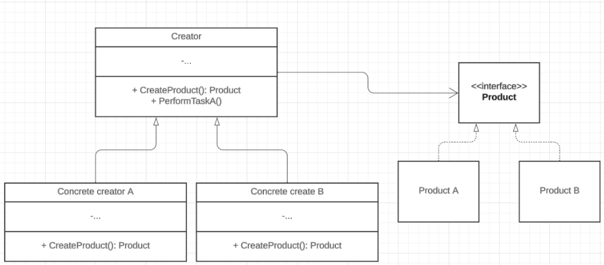
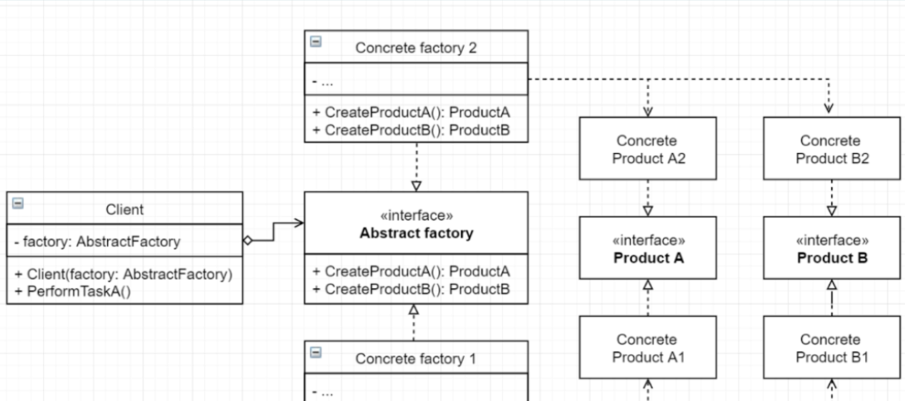
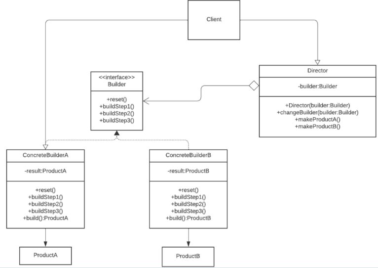
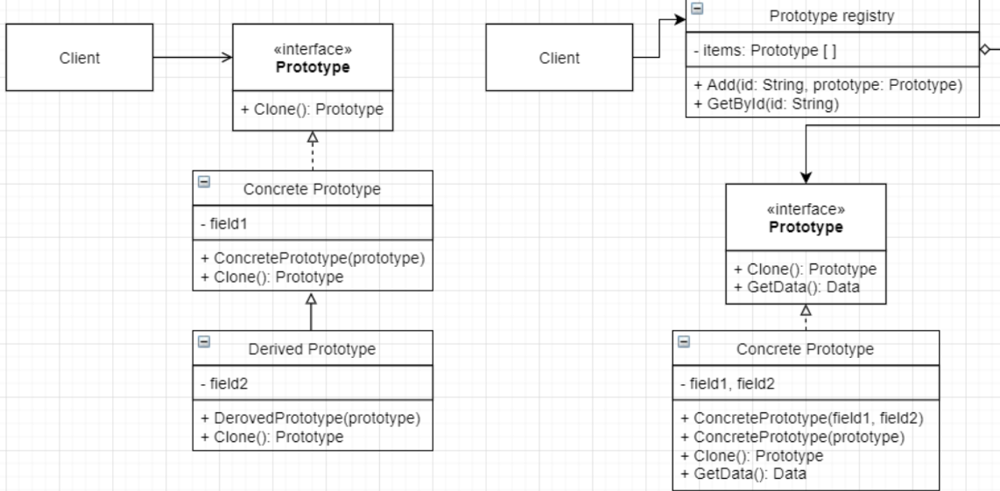
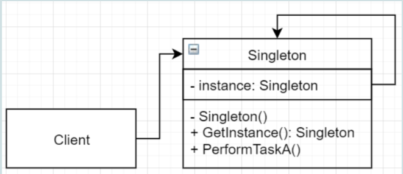

# Obrasci stvaranja
Obrasci stvaranja pružaju različite mehanizme stvaranja objekata, što povećava fleksibilnost i ponovnu upotrebu postojećeg koda. Omogućuju enkapsulaciju znanja o konkretnim klasama koje se rabe te skrivanje znanja o kreiranju i sklapanju objekata spomenutih klasa. Apstrahiraju proces stvaranja objekata

- Metoda tvornica
- Apstraktna tvornica
- Graditelj
- Prototip
- Singleton

## Metoda tvornica
### Dijagram


### Definicija
Definira sučelje za stvaranje objekta, ali ostavlja izbor podklasama koje klasu instanciraju.
Koristi se kada klasa ne zna unaprijed točan tip objekta koji će stvoriti.

### Primjer
Kako primjeniti metodu tvornicu na dani kod:
```cs
    class DragonDungeon
    {
        public void OpenDragonDungeon()
        {
            Console.WriteLine("Open Dragon Dungeon");
        }
    }
    
    class IceDungeon
    {
        public void OpenIceDungeon()
        {
            Console.WriteLine("Open Ice Dungeon");
        }
    }

    class DungeonMaster
    {
        DragonDungeon dragonDungeon;
        IceDungeon iceDungeon;
        public void OpenDragonDungeon()
        {
            dragonDungeon = new DragonDungeon();
            dragonDungeon.OpenDragonDungeon();
        }
        public void OpenIceDragonDungeon()
        {
            iceDungeon = new IceDungeon();
            iceDungeon.OpenIceDungeon();
        }
    }
```

Rješenje:
```cs
    abstract class Dungeon{
        public abstract void Open();
    }

    class DragonDungeon : Dungeon
    {
        public override void Open()
        {
            Console.WriteLine("Open Dragon Dungeon");
        }
    }

    class IceDungeon : Dungeon
    {
        public override void Open()
        {
            Console.WriteLine("Open Ice Dungeon");
        }
    }

    abstract class DungeonFactory{
        public abstract Dungeon CreateDungeon();
    }

    class IceDungeonFactory : DungeonFactory
    {
        public override Dungeon CreateDungeon()
        {
            return new IceDungeon();
        }
    }

    class DragonDungeonFactory: DungeonFactory{
        public override Dungeon CreateDungeon()
        {
            return new DragonDungeon();
        }
    }

    class DungeonMaster{
        DungeonFactory dungeonFactory;
        public DungeonMaster(DungeonFactory dungeonFactory){
            this.dungeonFactory = dungeonFactory;
        }
        public void OpenDungeon(){
            dungeonFactory.CreateDungeon().Open();
        }
    }

```
### Poveži klase i metode s ulogama u obrascu

Zadatak:
|Generic                    | Contextual                |
|:--------------------------|:--------------------------|    
|Tvornica                   | DragonDungeon             |
|StvoriProizvod             | IceDungeon                |
|KonkretnaTvornicaA         | DungeonMaster             |
|KonkretnaTvornicaB         | Dungeon                   |    
|Proizvod                   | DungeonFactory            |
|ProizvodA                  | IceDungeonFactory         |
|Proizvod B                 | DragonDungeonFactory      |
|Client                     | CreateDungeon             |

Rješenje:
|Generic                    | Contextual                |
|:--------------------------|:--------------------------|    
|Tvornica                   | DungeonFactory            |
|StvoriProizvod             | CreateDungeon             |
|KonkretnaTvornicaA         | IceDungeonFactory         |
|KonkretnaTvornicaB         | DragonDungeonFactory      |    
|Proizvod                   | Dungeon                   |
|ProizvodA                  | IceDungeon                |
|ProizvodB                  | DragonDungeon             |
|Client                     | DungeonMaster             |


### Koja SOLID načela vidimo

SRP - Klasa game nemora za svaki Dungeon implementirati stvaranje

OCP - Možeš dodavati nove Dungeons bez mijenjanja koda

DIP - Game i Dungeon klase ovise o apstrakciji tj o apstraktnoj klasi Dungeon

LSP - Dungeon Klase su međusobno zamjenjive


### Povezani obrasci
Obrasci stvaranja cesto pocnu kao Metoda Tvornica (jednostavnija) ali se kroz vrijeme pretvore u Builder, Apstraktnu Tvornicu ili Prototype(složeniji)

Apstraktna tvornica je cesto implementirana pomoću Metoda Tvornica

Sličan prototipu

Metoda tvornica je specijalizacija Predložak Metode

Metoda tvornica moze biti korak u vecoj Predložak Metodi


### Koraci implementacije

1. Napravi da svi proizvodi moraju pratiti isto sučelje
2. Stvori klasu Tvornica u toj klasi definiraj metodu za stvaranje
3. Povratni podatak metode za stvaranje treba biti sucelje(iz koraka 1) koje je zajednicko za sve proizvode
4. Za svaki proizvod izvedi Konkretnu Tvornicu koja stvara tj. vraca instancu tog proizvoda

### Kada koristiti
- Kada klasa ne može predvidjeti klase objekata koje mora stvoriti
- Klasa želi da njene podklase odrede konkretne objekte koje stvaraju
- Klasa delegira odgovornost na nekoliko različitih pomoćnih podklasa, a znanje o tome kojoj konkretnoj se želi lokalizirati

### Posljedice
#### Pozitivne:
- Izbjegavas cvrstu spregu između kreatora i konkretnih proizvoda
- SRP - Možeš pomaknuti sav kod stvaranja u jedno mjesto u programu
- OCP- Možeš dodavati nove proizvode bez da mjenjas postojeci kod 
- Imas paralelne hijerarhije koje su u labavoj sprezi
#### Negativne:
- Kod postaje kompliciraniji zbog dodavanja novih klasa tj, klasa za kreiranje proizvoda.

## Apstraktna tvornica
### Dijagram


### Definicija
Oblikovni obrazac stvaranja koji omogućava stvaranje obitelji povezanih proizvoda bez specificiranja konkretnih klasa.

### Primjer
Kako primjeniti apstraktnu tvornicu na dani kod:
```cs
    public class FireWizard{
        public void DoFireMagic()
        {
            Console.WriteLine("Do Fire Magic");
        }
    }

    public class WaterWizard{
        public void DoWaterMagic(){
            Console.WriteLine("Do Water Magic");
        }
    }

    public class FireGoblin{
        public void DoFireDamage(){
            Console.WriteLine("Do Fire Damage");
        }
    }

    public class WaterGoblin
    {
        public void DoWaterDamage(){
            Console.WriteLine("Do Water Damage");
        }
    }

    public class GameManager{
        public void PlayWaterLevel(){
            WaterGoblin waterGoblin = new WaterGoblin();
            WaterWizard waterWizard = new WaterWizard();
            waterGoblin.DoWaterDamage();
            waterWizard.DoWaterMagic();
        }

        public void PlayFireLevel(){
            FireGoblin fireGoblin = new FireGoblin();
            FireWizard fireWizard = new FireWizard();
            fireGoblin.DoFireDamage();
            fireWizard.DoFireMagic();
        }
    }
```
### Poveži klase i metode s ulogama u obrascu
Zadatak:
|Generic                    | Contextual                |
|:--------------------------|:--------------------------|
|Apstraktna tvornica        |Goblin                     |
|Konkretna tvornica         |Fire                       |
|Proizvod                   |FireCharachterFactory      |
|Konkretni proizvod         |CharacterFactory           |
|Klijentski kod             |WaterWizard                |
|Obitelj                    |CreateWizard               |
|Metoda stvaranja           |GameManager                |

Rješenje:
|Generic                    | Contextual                |
|:--------------------------|:--------------------------|
|Apstraktna tvornica        |CharacterFactory           |
|Konkretna tvornica         |FireCharachterFactory      |
|Proizvod                   |Goblin                     |
|Konkretni proizvod         |WaterWizard                |
|Klijentski kod             |GameManager                |
|Obitelj                    |Fire                       |
|Metoda stvaranja           |CreateWizard               |


### Koja SOLID načela vidimo
- SRP- klasa Game sad samo koristi listu tvornica umjesto da instancira vise klasa proizvoda
- OCP- suceljem proizvoda i apstraktnom tvornicom omogucujemo prosirenje tj. mozemo dodati jos tipova proizvoda bez da mjenjamo kod u Game klasi
- DIP- konkretne klase ovise o apstrakcijama tj. FireWizard, WaterWizard, FireGobili, WaterGoblin, FireFactory, WaterFactory sad ovise o IGoblin i IWizard suceljima
- ISP - IWizard i IGoblin su odvojeni umjesto da su spojeni u npr. ICharacter
- LSP - Konkretne Klase Factory su međusobno zamjenjive

### Povezani obrasci
- Apstraktne tvornice često se implementiraju uporabom metoda tvornica
- Apstraktna tvornica je cesto singleton
- Apstraktna tvornica moze biti alternativa Fasadi kad zelis sakriti nacin na koji se objekti kreiraju od klijentskog koda
- Prototip se može koristiti za sklapanje metoda na klasama
- Može se koristiti sa Mostom. Ova kombinacija je korisna kad Most može raditi samo sa specifičnim implementacijama. U ovom slučaju Apstraktna Tvornica moze enkapsulirati te veze i sakriti kompleksnost od klijentskog koda

### Koracij implementacije
1. Napravi mapu proizvoda i vrsta proizvoda
2. Deklariraj apstraktna sučelja proizvoda za sve vrste proizvoda. Zatim implementiraj sučelja u konkretne proizvode
3. Deklariraj sučelje apstraktne tvornice s nizom metoda za stvaranje svih apstraktnih proizvoda.
4. Implementiraj niz konkretnih tvornica izvedenih iz apstraktne tvornice, jedan za svaku varijantu proizvoda.
5. Stvori kod za inicijalizaciju tvornice negdje u aplikaciji. Trebala bi instancirati jedan od konkretnih tvorničkih razreda, ovisno o konfiguraciji aplikacije ili trenutačnom okruženju.

### Kada koristiti
- Koristi kad tvoj kod mora raditi sa različitim obiteljima povezanih proizvoda, a ne zelis ovisiti o konkretnoj klasi tj. zelis ostaviti prostora za proširenje
- Ako imas vise Metoda Tvornica moguce je da su povezane i mozes ih ujediniti.
- Kad klijentski kod treba biti neovisan o pojedinostima stvaranja proizvoda

### Posljedice
#### Pozitivne
- Proizvodi koje dobivamo od tvornice su međusobno kompatibilni
- Izbjegavas cvrstu spregu između proizvoda i klijentskog koda - kod ovisi o sučelju proizvoda
- SRP - kod stvaranja proizvoda mozes izvuci na jedno mjesto
- OCP - možeš stvoriti nove vrste proizvoda bez mijenjanja trenutnog koda
#### Negativne
- Kod postaje kompleksniji zbog dodatnih klasa


## Graditelj

### Dijagram


### Definicija
Obrazac stvaranja koji omogućava stvaranje kompleksnih objekata korak po korak.
Omogućuje stvaranje različite reprezentacije objekta sa istim kodom stvaranja

### Primjer
Na dani kod primjeni graditelja:
```cs
    public interface Type { }
    public class Fire : Type { }
    public class Water : Type { }
    public class Normal : Type { }

    public interface Species { }
    public class Human : Species { }
    public class Elf : Species { }
    public class Dwarf : Species { }

    public interface Armor { }
    public class SteelArmor : Armor { }
    public class LeatherArmor : Armor { }

    public class Player{
        Type type;
        Species species;
        Armor armor;
        public Player(Type type, Species species, Armor armor){
            this.type = type;
            this.species = species;
            this.armor = armor;
        }
        public void Play(){
            Console.WriteLine("Play");
        }
    }
```
Rješenje:
```cs
    public interface Type { }
    public class Fire : Type { }
    public class Water : Type { }
    public class Normal : Type { }

    public interface Species { }
    public class Human : Species { }
    public class Elf : Species { }
    public class Dwarf : Species { }

    public interface Armor { }
    public class SteelArmor : Armor { }
    public class LeatherArmor : Armor { }

    public class Player
    {
        public Type Type {get; set;}
        public Species Species {get; set;}
        public Armor Armor {get; set;}

        public Player(){}

        public Player(Type type, Species species, Armor armor)
        {
            Type = type;
            Species = species;
            Armor = armor;
        }

        public void Play()
        {
            Console.WriteLine("Play");
        }
    }

    public interface IPlayerBuilder{
        public IPlayerBuilder Type(Type type);
        public IPlayerBuilder Spicies(Species species);
        public IPlayerBuilder Armor(Armor armor);
        public IPlayerBuilder Reset();
        public Player Build();
    }

    public class PlayerBuilder : IPlayerBuilder
    {
        Player player;
        public PlayerBuilder(){
            player = new Player();
        }

        public IPlayerBuilder Armor(Armor armor)
        {
            player.Armor = armor;
            return this;
        }

        public IPlayerBuilder Reset()
        {
            player = new Player();
            return this;
        }

        public IPlayerBuilder Spicies(Species species)
        {
            player.Species = species;
            return this;
        }

        public IPlayerBuilder Type(Type type)
        {
            player.Type = type;
            return this;
        }

        public Player Build(){
            return player;
        }
    }

    public class PlayerManager{
        IPlayerBuilder builder;

        public PlayerManager(IPlayerBuilder builder){
            this.builder = builder;
        }

        public void ChangeBuilder(IPlayerBuilder builder){
            this.builder = builder;
        }

        public Player BuildSteelDwarf(){
            return builder
                .Reset()
                .Armor(new SteelArmor())
                .Spicies(new Dwarf())
                .Type(new Normal())
                .Build();
        }
    }
```
### Poveži klase i metode s ulogama u obrascu
|Generic                    | Contextual                |
|:--------------------------|:--------------------------|
|IPlayerBuilder             |buildStep                  |
|PlayerBuilder              |Builder interface          |
|PlayerManager              |Director                   |
|Armor(Armor armor)         |Concrete builder           |

### Koja SOLID načela vidimo
- SRP - Klasa Player ima samo jednu svrhu
- OCP - Možemo definirati nove graditelje bez da mijenjamo postojece zbog Graditelj apstrakcije
- LSP - Konkretni graditelji su međusobno zamjenjivi u direktor klasi
- DIP- Direktor i Graditelji ovise o Graditelj apstrakcije a ne jedan o drugome

### Povezani obrasci
- Često počne kao metoda tvornica ili apstraktna tvornica pa se kroz vrijeme prebaci u - Graditelja zbog vece promjenjivosti (customizable) tj. jer gradi objekte korak po korak
- Graditeljem se često Grade kompoziti

### Koracij implementacije
1. Definiraj korake stvaranja objekta
1. Definirane korake sklopi kao Graditelj sučelje
2. Implementiraj sucelje kao konkretan Graditelj
Opcionalno:
3. Stvori direktor klasu koja nudi gotove izgradnje proizvoda
4. Klijent može koristiti gotove gradnje iz Direktora
5. Klijent može definirati svoje gradnje pomoću konkretnog Graditelja

### Kada koristiti
- Kad zelimo različite reprezentacije objekta ovisno o njegovim atributima tj. dijelovima objekta
- Kad zelimo da objekt koji se stvara ne bude ovisan o dijelovima od kojih je objekt sastavljen i 
- Kad zelimo da objekt koji se stvara ne bude ovisan o nacinu na koji su dijelovi objekta složeni

### Posljedice
#### Pozitivne
- Možeš  stvarati objekt korak po korak. 
- Mozes koristiti isti kod sklapanja kad radite drugačije reprezentacije proizvoda
- SRP - Izdvajas kod sklapanja od poslovne logike proizvoda
#### Negativne
- Kompleksnost se povećava zbog stvaranja novih klasa.

## Prototip
### Dijagram


### Definicija
Obrazac stvaranja koji nam omogućava kopiranje postojećih objekata bez da ovisimo o njihovim klasama.

### Primjer
Na zadani kod primjeni prototip:
```cs
        public class Cat
        {
            public string name;
            public string weight;
            private string type;
            public Cat(string name, string weight, string type)
            {
                this.name = name;
                this.weight = weight;
                this.type = type;
            }
            public void LogData()
            {
                Console.WriteLine($"{name},{weight},{type}");
            }
        }

```

Rješenje:
```cs
public interface ICloneable{
            object Clone();
        }

        public class Cat:ICloneable
        {
            public string name;
            public string weight;
            private string type;
            public Cat(string name, string weight, string type)
            {
                this.name = name;
                this.weight = weight;
                this.type = type;
            }

            public object Clone()
            {
                return new Cat(name, weight, type);
            }

            public void LogData()
            {
                Console.WriteLine($"{name},{weight},{type}");
            }
        }

        public class Clowder{
            private List<ICloneable> cats;
            public void Add(ICloneable clone){
                cats.Add(clone);
            }

            public ICloneable GetById(int index){
                return cats[index];
            }
        }
```
### Poveži klase i metode s ulogama u obrascu
Zadatak:
|Generic                    | Contextual                |
|:--------------------------|:--------------------------|
|Clone()                    |Cat                        |
|Prototip                   |Clone()                    |
|Prototip registery         |ICloneable                 |
|Concrete prototype         |Clowder                    |

Rješenje:
|Generic                    | Contextual                |
|:--------------------------|:--------------------------|
|Clone()                    |Clone()                    |
|Prototip                   |IClonable                  |
|Prototip registery         |Clowder                    |
|Concrete prototype         |Cat                        |

### Koja SOLID načela vidimo
- SRP - Prototip je odgovoran za kloniranje sebe, ne klijentski kod
- OCP - dopušta stvaranje novih prototipova preko zajednickog interface, koji mogu ali ne moraju biti međusobno zamjenjivi

### Povezani obrasci
- Može se koristiti sa Apstraktnom Tvornicom tj. Apstraktna Tvornica moze koristiti Prototip za implementiranje funkcionalnosti kloniranja nad objektima koje stvara.
- Kompozit i dekorater mogu koristiti Prototip za kloniranje kompleksnih konfiguracija objekata kao što su kompozit i dekorator.

### Koraci implementacije
1. Stvori sučelje sa metodom Clone koja vraca objekt (genericki tip objekt u C#)
2. Klasa koja implementira sučelje implementira metodu Clone
3. Metoda Clone vraca tip Klase koja je implementira
4. Objekt koji Clone klasa vraca treba prekopirati sve privatne atribute u novu instancu

### Kada koristiti
- Kada kod ne treba ovisiti o konkretnim klasama objekata koje
je nužno kopirati
- Kada se želi smanjiti veličina hijerarhije klasa koja se sastoji od
sličnih objekata konfiguriranih na različite načine

### Posljedice
#### Pozitivne
- Možeš klonirati objekte bez njihove međusobne ovisnosti
- Možeš se riješiti ponavljajuce inicijalizacije kloniranjem objekata
- Možeš stvarati kompleksne objekte na laksi nacin

#### Negativne
- Kloniranje objekata koje imaju cirkularne veze je jako teško.

## Singleton
### Dijagram


### Definicija
Singleton je oblikovni obrazac stvaranja koji omogućava postojanje samo jedne instance klase kroz sustav.

### Primjer
Na zadani primjer primjeni singleton:
```cs
    public class Game {
        public GameManager gm = new GameManager();
        public Game()
        {
            gm.GetConfigs();
        }
    }

    public class Character
    {
        public GameManager gm = new GameManager();
        public Character()
        {
            gm.GetCharacters();
        }
    }

    public class UI
    {
        public GameManager gm = new GameManager();
        public UI()
        {
            gm.GetUIElements();
        }
    }

    public class GameManager
    {
        public void GetConfigs()
        {
            Console.WriteLine("Configs");
        }
        public void GetUIElements()
        {
            Console.WriteLine("UI Elements");
        }
        public void GetCharacters()
        {
            Console.WriteLine("Characters");
        }
    }

```

Rješenje:
```cs
    public class Game
    {
        public Game()
        {
            GameManager.GetGameManager().GetConfigs();
        }
    }

    public class Character
    {
        public Character()
        {
            GameManager.GetGameManager().GetCharacters();
        }
    }

    public class UI
    {
        public GameManager gm = GameManager.GetGameManager();
        public UI()
        {
            gm.GetUIElements();
        }
    }

    public class GameManager
    {
        private static GameManager gameManager;

        public static GameManager GetGameManager()
        {
            if (gameManager == null)
            {
                gameManager = new GameManager();
            }
            return gameManager;
        }

        public void GetConfigs()
        {
            Console.WriteLine("Configs");
        }

        public void GetUIElements()
        {
            Console.WriteLine("UI Elements");
        }

        public void GetCharacters()
        {
            Console.WriteLine("Characters");
        }
    }
```

### Poveži klase i metode s ulogama u obrascu
|Generic                    | Contextual                |
|:--------------------------|:--------------------------|
|Singleton                  |GetInstance                |
|GetInstance                |GameManager                |
|Client                     |Game, UI, Character        |

### Koja SOLID načela vidimo
- SRP - Prototip je odgovoran za kloniranje sebe, ne klijentski kod
- OCP - dopušta stvaranje novih prototipova preko zajednickog interface, koji mogu ali ne moraju biti međusobno zamjenjivi

### Povezani obrasci
- Može se koristiti sa Apstraktnom Tvornicom tj. Apstraktna Tvornica moze koristiti Prototip za implementiranje funkcionalnosti kloniranja nad objektima koje stvara.
- Kompozit i dekorater mogu koristiti Prototip za kloniranje kompleksnih konfiguracija objekata kao što su kompozit i dekorator.

### Koracij implementacije
1. Učiniti konstruktor klase privatnim
2. Deklarirati privatnu statičku referencu
3. Kreirati statičku metodu koja će poslužiti kao konstruktor,
odnosno stvorit će objekt upotrebom privatnog konstruktora i
pohraniti ga u ranije spomenutu referencu
4. Svaki poziv nakon prvog poziva vratit će referencu na
postojeći objekt

### Kada koristiti
- Kad je potrebna samo jedna instanca klase u sustavu
- Kad je potrebna jedna tocka pristupa
- Kada instanca treba imati mogućnost nasljeđivanja i
klijenti trebaju imati mogućnost proširenja instance bez
promjene vlastitog koda

### Posljedice
#### Pozitivne
Kontrolirani pristup jednoj instanci

Bolje rješenje od globalnih varijabli– osigurava stvaranje 1 instance

Omogućuje lijeno instanciranje

Dopušta izmjene

Dopušta izmjene

Dopušta drugačiji broj instanci– lako se predomisliti oko broja instanci

Može poboljšati performanse;

#### Negativne
Narušava SRP

Skriva loš dizajn

Traži pozornost kod višenitnih aplikacija

Zahtjevan kod testiranja


## Zadaci
Za primjer dan izlistanjem koda odredite obrazac o kojemu je riječ i njegovu skupinu. Dopunite kod implementacijom koja nedostaje te napišite klijentski kod za ovaj primjer.

### Zadatak 1
```cs
 public class Mail{
        public string Subject {get;set;}
        public string Content {get;set;}
        public string Recipient {get;set;}
        public string Attachments {get;set;}
    }

    public class MailConstructor{
        Mail mail;
        public MailConstructor() {
            mail = new Mail();
        }
        public IMailConstructor AddRecipient(string recipient){
            mail.Recipient = recipient;
        }
        public IMailConstructor AddRecipient(string recipient){
            mail.Recipient= recipient;
        }
        public Mail Construct(){
            return mail;
        }
    }

    public class SMTP {
        IMailConstructor mailConstructor;
        public SMTP(IMailConstructor mailConstructor) {
            this.mailConstructor = mailConstructor;
        }

        public void SendNoReplyMail(){
            mailConstructor.AddSubject("No Reply").AddContent("Hello World").Construct();
            //Sending logic here
        }
    }
```

### Zadatak 2
```cs

    public class WebElement{
        string name;
        public WebElement(string name){
            Console.WriteLine($"Found {name}");
            this.name = name;
        }
        public void Click(){
            Console.WriteLine($"Clicked {name}");
        }
    }

    public interface LoginPage{
        public WebElement loginButton();
        public WebElement usernameInput();
        public WebElement passwordInput();
    }

    public class ChromeLoginPage:LoginPage{
    }

    public abstract class LoginPageFactory{
        public abstract LoginPage CreatePage();
    }
```
