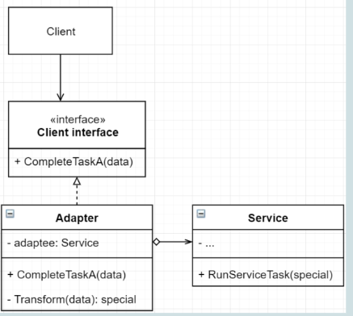
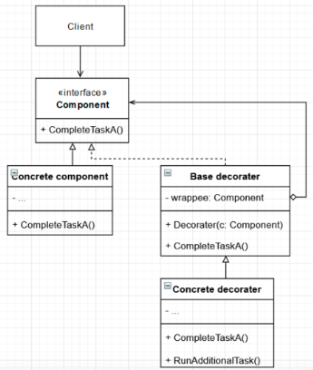
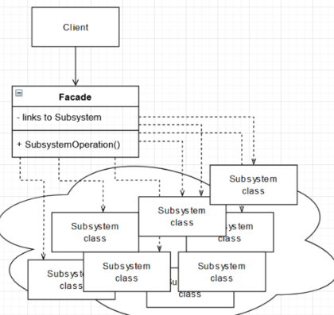
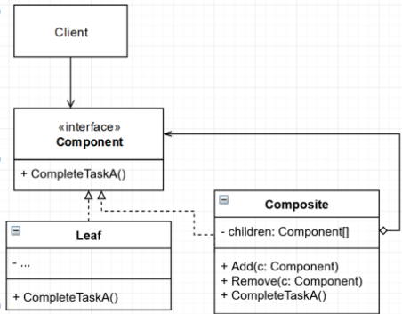
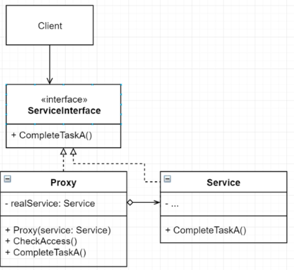
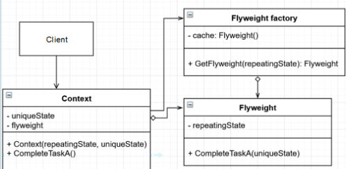
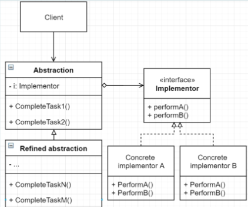

# Obrasci strukture
Strukturni obrasci objašnjavaju kako sastaviti objekte i klase u vece strukture koje su flexibline i efikasne.

- Adapter
- Dekorater
- Fasada
- Kompozit
- Proxy
- Flyweight
- Most

## Adapter

### Dijagram

### Definicija
Adapter je oblikovni obrazac strukture koji dopusta objektima sa nekompatibilnim sučeljima da rade zajedno
### Primjer
Kako primjeniti adapter na ovaj problem
```cs
    public interface ILogger{
        void Log(string message);
    }

    public class ConsoleLogger : ILogger
    {
        public void Log(string message)
        {
            Console.WriteLine(message);
        }
    }

    //Pravimo se da je ovo vanjska klasa i nemožemo ju mjenjat
    public class FilerLoggerService{
        public void LogToFile(string message){
            Console.WriteLine($"Logging message to file. Message:{message}");
        }
    }

    //ConsoleLogger više ne žeilmo, kako ćemo 
    //omogućiti Klijentskom kodu da koristit servisnu klasu
    // preko ILogger sučelja

    public static class ClientCode
    {
        public static void Run()
        {
            ILogger logger = new ConsoleLogger();

            logger.Log("Hello World");
        }
    }
```

Rješenje: [Adapter.cs](/DevOfSwSuppWithOOP/DesignPatterns/Structural/Examples/Adapter.cs)
```cs
    public interface ILogger{
        void Log(string message);
    }

    public class ConsoleLogger : ILogger
    {
        public void Log(string message)
        {
            Console.WriteLine(message);
        }
    }

    //Pravimo se da je ovo vanjska klasa i nemožemo ju mjenjat
    public class FilerLoggerService{
        public void LogToFile(string message){
            Console.WriteLine($"Logging message to file. Message:{message}");
        }
    }

    public class FileLoggerAdapter:ILogger{
        FilerLoggerService fileLoggerService;
        public FileLoggerAdapter(){
            fileLoggerService = new FilerLoggerService();
        }

        public void Log(string message){
            fileLoggerService.LogToFile(message);
        }
    }
```

### Poveži klase i metode s ulogama u obrascu
|Generic                    | Contextual                |
|:--------------------------|:--------------------------|    
|Client interface           | FilerLoggerAdapter        |
|CompleteTaskA              | FileLoggerService         |
|RunServiceTask             | Log                       |
|Service                    | ConsoleLogger             |
|Adapter                    | ILogger                   |

### Koja SOLID načela vidimo
- SRP - Bez Adaptera klijentski kod bi trebao direktno koristiti Servisnu klasu i time raditi implementaciju koju sa Adapterom izbjegava 
- OCP - Nakon što je adaptersko sučelje definirano možemo dodati koliko adaptera je potrebno
- LSP - implementacijom sucelja izbjegavamo kresenje LSP-a
- ISP - klijentsko sučelje sadrži samo funkcije koje su potrebne za izradu adaptera
- DIP - implementacijom sucelja slijedimo DIP tako sto ovisimo o apstrakciji a ne o konkretnoj Servisnoj klasi

### Povezani obrasci
- Sličan Mostu. Most se dizajnira unaprijed a Adapter služi za implementiranje suradnje ne kompatibilnih klasa
- Sličan Dekorateru. Dekorater podržava kompoziciju
- Sa adapterom se pristupa servisnom objektu preko razlicitog sučelja. Kod proxya sucelje ostaje isto
- Fasada daje novo sučelje za skup objekata. Adapter pokušava postujuce sučelje iskoristiti
- Fasada omotava skup objekata, adapter samo jedan

### Koraci implementacije
1. Za implementaciju adaptera trebaju ti barem dvije klase sa nekompatibilnim sučeljima 
    1. Servisna klasa koju ne mozes promijeniti (uglavnom iz nekog stranog namespace-a)
    2. Klijentska klasa kojoj bi koristilo da moze koristiti Servisnu klasu
2. Napravi klijentsko sučelje koje opisuje kako servisna i klijentska klasa surađuju
3. Napravi adaptersku klasku koja prati klijentsko sucelje. Ostavi metode prazne za sad
4. Dodaj u Adapter klasu instancu Servisne klase
    1. Servisnu klasu mozes instancirati na način koji pase tvom kontekstu (konstruktor, metoda, direktno, …)
5. Implementiraj sve metode klijentskog sučelja u adapter klasi. Adapter treba delegirati većinu posla na objekt Servisne klase. Adapter se treba brinuti o tome kako prilagoditi metode Servisne klase potrebama klijentske (ugl. kroz transformaciju podataka)
6. Klijent koristi adapter preko sučelja. Sa ovim možeš mijenjati adapter bez mijenjanja klijentskog koda

### Kada koristiti
- Koristi Adaptera kad zelis koristiti neku postojeću klasu ali njezino sucelje nije kompatibilno sa ostatkom tvog koda
- Koristi kad želiš iskoristiti postojece pod klase koje manjkaju zajedničku funkcionalnost koja ne može biti dodana podklasama

### Posljedice
#### Pozitivne
- SRP - Možeš odvojiti sučelje ili transformaciju podataka od poslovne logike
- OCP - Možeš dodavati različite adaptere bez mijenjanja postojećeg koda sve dok program radi sa adapterima kroz klijentsko sučelje
#### Negativne
- Kompleksnost se povećava jer moramo uvesti nove klase i sučelja


## Dekorater

### Dijagram

### Definicija
Dekorater je strukturni obrazac koji omogućuje dodavanje novih ponašanja na objekt tako sto stavlja objekt unutar posebnih omotaca koji sadržavaju dodatno ponašanje

### Primjer
Na zadani kod primjeni dekoratera:
```cs
public class BaseHealthEffect
    {
        public void ApplyBaseHealth()
        {
            Console.WriteLine("Apply Base Health");
        }
    }

    public class HealthRegeneration
    {
        public void ApplyHealthRegeneration()
        {
            Console.WriteLine("Health Regen");
        }

    }
    public class ArmorBuff
    {
        public void IncreaseArmor()
        {
            Console.WriteLine("Armor Increase");
        }
    }

    public class MagicDamage
    {
        public void IncreaseMagicDamage()
        {
            Console.WriteLine("Magic Dmg");
        }
    }

    public class Player
    {
        BaseHealthEffect baseHealthEffect;
        HealthRegeneration healthRegeneration;
        ArmorBuff armorBuff;
        MagicDamage magicDamage;
        public Player()
        {
            baseHealthEffect = new BaseHealthEffect();
            healthRegeneration = new HealthRegeneration();
            armorBuff = new ArmorBuff();
            magicDamage = new MagicDamage();
            baseHealthEffect.ApplyBaseHealth();
            healthRegeneration.ApplyHealthRegeneration();
            armorBuff.IncreaseArmor();
            magicDamage.IncreaseMagicDamage();
        }
    }

    public static class ClientCode
    {
        public static void Run()
        {
            new Player();
        }
    }
```
Rješenje:
```cs
```
### Poveži klase i metode s ulogama u obrascu


### Koja SOLID načela vidimo
- SRP - Umjesto da dekoratersku funkcionalnost implementiramo na jednom mjestu funkcionalnosti su razdvojene i mogu se konfigurirati
- OCP - Možemo dodavati dekoratere po potrebi
- LSP - Dekorateri su međusobno zamjenjivi
- ISP - Dekoratersko sucelje sadrži odabrane metode vezane za zeljenu implementaciju
- DIP - Dekorater ovisi o apstrakciji, implementira sučelje i sadrži referencu na sucelje u sebi

### Povezani obrasci
- Kao Kompozit dodaje odgovornosti objektima
- Kao strategija mijenja kozu umjesto iznutrica
- Kao Kompozit, Adapter i Proxy omataju objekt
- Dekorater, Kompozit i Lanac odgovornosti oslanjaju se na rekurzivnu kompoziciju

### Koraci implementacije
1. Pobrini se da klasa može postojati sa trenutnom logikom sama sa sobom
2. Odaberi metode koje su zajednicke glavnoj klaski i opcionalnim dekoracijama
3. Od odabranih metoda napravi sucelje
4. Implementiraj glavnu klasu - nasljeđuje napravljeno sučelje
5. Napravi temeljnog dekorater - nasljeđuje napravljeno sucelje
treba sadrzavati atribut tipa napravljenog sučelja - ima sučelje u sebi
6. Ako zelis dodatne decoratore mozes ih izvesti iz temeljnog
7. Klijentski kod konfigurira decoratore

### Kada koristiti
- Koristi Dekorater kad trebas tijekom izvođenja programa dati extra ponašanje objektima bez lomljenja koda koji koristi ove objekte
- Kad je cudno ili nemoguce naslijediti objekt u svrhu proširenja ponašanja objekta

### Posljedice
#### Pozitivne
- Moguce prosiriti ponašanje objekta bez dodavanja pod klasa
- Moguce dodavati i sklanjati odgovornosti objekta kroz izvođenje (at runtime)
- Moguce kombinirati ponašanje omatanjem objekata (babushka dolls)
- Moguce razbiti monolitnu klasu u vise malih 

#### Negativne
- Tesko ukloniti specifični omotac sa stoga omotaca
- Tesko je implementirati dekorater na način da ponašanje ne ovisi o poretku omotaca


## Fasada

### Dijagram


### Definicija
Facade is a structural design pattern that provides a simplified interface to a library, a framework, or any other complex set of classes. 

### Primjer
Na dani kod primjeni fasadu:
```cs
    public class SpawnManger
    {
        public int mobs = 0;
        public void SpawnMob()
        {
            mobs++;
        }
        public void UnspawnMob()
        {
            mobs--;
        }
    }

    public class EnemyManager
    {
        public int enemies = 0;
        public void SpawnEnemie()
        {
            enemies++;
        }
    }

    public class EffectManager
    {
        public void MagicEffect()
        {
            Console.WriteLine("Magic");
        }
        public void FireEffect()
        {
            Console.WriteLine("Fire");
        }
        public void WaterEffect()
        {
            Console.WriteLine("Water");
        }
    }

    class ClientCode
    {
        public static void Run()
        {
            EffectManager effectManager = new EffectManager();
            SpawnManger spawnManger = new SpawnManger();
            EnemyManager enemyManager = new EnemyManager();

            string type = "Fire";

            if (type == "Magic")
            {
                effectManager.MagicEffect();
            }
            else if (type == "Fire")
            {
                effectManager.FireEffect();
            }
            else if (type == "Water")
            {
                effectManager.WaterEffect();
            }
            else
            {
                throw new Exception("Effect type doesn't exist");
            }

            Random random = new Random();
            if (random.Next(0, 1) == 0)
            {
                spawnManger.SpawnMob();
            }
            else if (random.Next(0, 1) == 1)
            {
                enemyManager.SpawnEnemie();
            }
            else
            {
                spawnManger.UnspawnMob();
            }
        }
    }
```
Rješenje:
```cs
public class SpawnManger
        {
            public int mobs = 0;
            public void SpawnMob()
            {
                mobs++;
            }
            public void UnspawnMob()
            {
                mobs--;
            }
        }

        public class EnemyManager
        {
            public int enemies = 0;
            public void SpawnEnemie()
            {
                enemies++;
            }
        }

        public class EffectManager
        {
            public void MagicEffect()
            {
                Console.WriteLine("Magic");
            }
            public void FireEffect()
            {
                Console.WriteLine("Fire");
            }
            public void WaterEffect()
            {
                Console.WriteLine("Water");
            }
        }

        public interface IManager
        {
            public void ApplyEffect(string type);
            public void RandomSpawn();
        }

        public class Manager : IManager
        {
            SpawnManger spawnManger;
            EffectManager effectManager;
            EnemyManager enemyManager;
            public Manager()
            {
                spawnManger = new SpawnManger();
                effectManager = new EffectManager();
                enemyManager = new EnemyManager();
            }

            public void ApplyEffect(string type)
            {
                if (type == "Magic")
                {
                    effectManager.MagicEffect();
                }
                else if (type == "Fire")
                {
                    effectManager.FireEffect();
                }
                else if (type == "Water")
                {
                    effectManager.WaterEffect();
                }
                else
                {
                    throw new Exception("Effect type doesn't exist");
                }
            }

            public void RandomSpawn()
            {
                Random random = new Random();
                if (random.Next(0, 1) == 0)
                {
                    spawnManger.SpawnMob();
                }
                else if (random.Next(0, 1) == 1)
                {
                    enemyManager.SpawnEnemie();
                }
                else
                {
                    spawnManger.UnspawnMob();
                }
            }
        }

        class ClientCode
        {
            public static void Run()
            {
                IManager manager = new Manager();
                manager.ApplyEffect("Fire");
                manager.RandomSpawn();
            }
        }
```

### Poveži klase i metode s ulogama u obrascu
|Generic                    | Contextual                |
|:--------------------------|:--------------------------|    
|Fasada                     | SpawnManager              |
|Podsustav                  | Manager                   |
|RunServiceTask             | EnemyManager              |
|RunServiceTask             | EffectManager             |

### Povezani obrasci
- Fasada definira novo sučelje, Adapter pokušava koristiti postojeće.
- Adapter omotava jedan objekt, Fasada omotava cijeli podsistem objekata.
- Apstraktna tvornica moze sluziti kao alternativa Fasadi kad želiš sakriti način na koji se objekti stvaraju od klijentskog koda
- Flyweight pokazuje kako stvoriti vise manjih objekata dok Fasada pokazuje kako napraviti jedan veliki objekt
- Fasada je često i singleton jer je jedna instanca fasade često dovoljna.
- Fasada kao i Proxy kontrolira podsistem. Samo sto proxy ima isto sučelje kao i svoj podsistem/servis

### Koraci implementacije
1.  Analiziraj sistem za moguce grupiranje pod sustava iza jednog sučelja
2. Deklariraj i implementiraj fasadno sučelje 
4. Mozda je dobro da razlomci fasadno sučelje u vise manjih (ISP nacelo)

### Kada koristiti
- Koristi kad zelis kompleksan sustav predstaviti jednostavnijim sučeljem
- Koristi kad zelis podsustave strukturirati u slojeve

### Posljedice
- Izolira kompleksnost od podsistema
- Fasada može postati god object (anti-obrazac)


## Kompozit

### Dijagram


### Definicija
Kompozit je strukturno oblikovni obrazac koji omogućuje sklapanje objekata u stablastu strukturu i onda radi sa tim strukturama kao da su jedinstveni objekti

### Primjer
Na zadani kod primjeni kompozit:
```cs
    public class Item{
        string name;
        int price;
        public Item(string name, int price){
            this.name = name;
            this.price = price;
        }
        public string Name { get { return name; } }
        public int Price { get { return price;}}
    }

    public class Package{
        string name;
        List<Item> items;

        public Package(string name){
            this.name = name;
            items = new List<Item>();
        }

        public void AddItem(Item item){
            items.Add(item);
        }

        public void RemoveItem(Item item){
            items.Remove(item);
        }
        public string Name{ get { return name; } }
        public List<Item> Items{ get{return items;}}
    }

    public static class ClientCode
    {
        public static void Run()
        {
            Package package = new Package("Package1");
            int totalPrice=0;
            package.AddItem(new Item("Sat", 20));
            package.AddItem(new Item("Pan", 30));
            package.Items.ForEach(item=>{
                totalPrice+=item.Price;
            });

            Console.WriteLine($"{totalPrice}");
            //kako dodati paket u paket?
            //sta ako imamo razlicite vrste paketa i itema?
        }
    } 
```
Rješenje:
```cs
    public interface IItem{
        public string Name {get;}
        public int Price {get;}
    }

    public class Item:IItem{
        string name;
        int price;

        public Item(string name, int price){
            this.name = name;
            this.price = price;
        }

        public string Name { get { return name; }}
        public int Price { get { return price;}}
    }

    public class Package:IItem{
        string name;
        int price;

        List<IItem> items;

        public Package(string name){
            this.name = name;
            items = new List<IItem>();
        }

        public string Name { get { return name; }}
        public int Price { get { 
            price = 0;
            items.ForEach(item=>{
                price+=item.Price;
            });
            return price;
            }}

            public void AddItem(IItem item){
            items.Add(item);
        }

        public void RemoveItem(IItem item){
            items.Remove(item);
        }
    }

    public static class ClientCode
    {
        public static void Run()
        {
            Package smallPackage = new Package("SmallPackage");
            smallPackage.AddItem(new Item("Pan", 20));
            smallPackage.AddItem(new Item("Mouse", 30));

            Package bigPackage = new Package("BigPackage");
            bigPackage.AddItem(smallPackage);
            bigPackage.AddItem(new Item("Lamp", 30));

            Console.WriteLine($"{bigPackage.Price}");
        }
    }
```
### Poveži klase i metode s ulogama u obrascu
Zadatak:
|Generic                    | Contextual                |
|:--------------------------|:--------------------------|    
|Composite                  | Item                      |
|Leaf                       | Package                   |
|children                   | IItem                     |
|CompleteTaskA              | Price                     |
|Component                  | items                     |

Rješenje:
|Generic                    | Contextual                |
|:--------------------------|:--------------------------|    
|Composite                  | Package                   |
|Leaf                       | Item                      |
|children                   | items                     |
|CompleteTaskA              | Price                     |
|Component                  | IITems                    |

### Koja SOLID načela vidimo
- OCP - Možemo dodavati komponenata koliko je potrebno
- LSP - Listovi i kontejneri tj svi komadi opreme su međusobno zamjenjivi
- DIP - ovisimo o apstrakciji IElectrical

### Povezani obrasci
- Kompozit i builder mogu biti korišteni zajedno
- Iterator za obilaženje stabla
- Dekorater, Proxy, Adapter i Kompozit imaju sličnu strukturu
- Dekorater i Kompozit koriste kompozitnu rekurziju
- Slične Listove možemo implementirati kao Flyweight

### Koraci implementacije
1. Model aplikacije treba biti moguce reprezentirati kao stablastu strukturu.
2. Nadji sučelje zajednicko kompleksnijim i jednostavnim objektima
3. Definiraj klasu listic koja ce predstavljati jednostavne elemente
4. Definiraj kompozitsku klasu koja predstavlja kompleksne elemente
5. Listici odrađuju posao, kompoziti delegiraju posao na listice, nakon što dobiju rezultate kompoziti sklapaju podatke i vraćaju podatke pozivatelju
6. Klijent rabi sve elemente samo kroz sučelje komponente

### Kada koristiti
- Kad trebas implementirat stablastu strukturu objekata
- Kad zelis da klijentski kod tretira kompleksne i jednostavne objekte jednako

### Posljedice
#### Pozitivne
- Rad sa stubastim strukturama postaje jednostavniji - iskoristavas polimorfizam i rekurziju 
- Mozes dodavat različite tipove listica i kontejnera bez mijenjanja koda

#### Negativne
- Moze biti tesko naci zajednicko sučelje klasama koje su pre različite. To dovodi do pre generalizacije sučelja tj. sucelje postane primjenjivo na vise konteksta i postane teze za razumjetit


## Proxy

### Dijagram

### Definicija
Proxy je strukturni obrazac koji nam dozvoljava da pružimo zamjenu za neki objekt. Proxy kontrolira pristup originalnom objektu što nam daje mogućnost izvršavanja neke akcije prije ili poslije nego zahtjev dodje do originalnog objekta.

### Primjer
Na kod dolje primjeni proxy obrazac:
```cs
    public interface IChatGPTService{
        public void SendPrompt(string prompt);
    }

    public class ChatGPTService: IChatGPTService{
        public void SendPrompt(string prompt){
            Console.WriteLine($"Prompt was sent: {prompt}");
        }
    }

    public static class ClientCode
    {
        public static void Run()
        {
            //ovo radi ok ali zelimo veću kontrolu nad servisom,
            //kako ćemo to postići
            IChatGPTService chatGPTService = new ChatGPTService();
            chatGPTService.SendPrompt("Hello");
        }
    }
```
Rješenje:
```cs
    public interface IChatGPTService{
        public void SendPrompt(string prompt);
    }

    public class ChatGPTService: IChatGPTService{
        public void SendPrompt(string prompt){
            Console.WriteLine($"Prompt was sent: {prompt}");
        }
    }

    public class ChatGPTProxy:IChatGPTService{
        IChatGPTService chatGPTService;
        public ChatGPTProxy( IChatGPTService chatGPTService){
            this.chatGPTService = chatGPTService;
        }
        public void SendPrompt(string prompt){
            chatGPTService.SendPrompt(prompt);
        }
    }

    public static class ClientCode
    {
        public static void Run()
        {
            IChatGPTService chatGPTService = new ChatGPTProxy(new ChatGPTService());
            chatGPTService.SendPrompt("Hello");
        }
    }
```
### Poveži klase i metode s ulogama u obrascu
Zadatak:
|Generic                    | Contextual                |
|:--------------------------|:--------------------------|    
|Client                     | SendPrompt                |
|CompleteTaskA              | ClientCode                |
|Service                    | ChatGPTService            |

### Koja SOLID načela vidimo
- SRP - Umjesto da poslovna logika upravlja servisom proxy to radi
- OCP - Možemo dodavati dodatne proxyje
- LSP - Implementiranjem istog sučelje kao i servisna klasa proxy i servisna klasa postaju međusobno zamjenjivi
- DIP - I servis i proxy ovise o apstrakciji tj. sučelju servisa

### Povezani obrasci
- Sa adapterom pristupamo postojećem objektu preko - drugačijeg sučelja. Sa Proxijem sucelje ostaje isto. Sa dekorativom pristupamo objektu sa podebljanim sučeljem
- Fasada je slična Proxiju na način da iz oboje stoji komplexan sistem. Samo fasada nema isto sučelje kao sustav kojeg skriva
- Dekorater i Proxy su slični sa drugačijim namjerama.
- Dekorater, Proxy, Adapter i kompozit iskorištavaju princip kompozicije
- Proxy upravlja životnim tokom servisnog objekta dok Dekorater u potpunosti kontrolira klijent

### Koraci implementacije
1. Mozes ovisno o situaciji:
    1. Ako ne postoji sučelje na servis, stvoriti jedno kako bi objekti proxyja i objekti servisa bili međusobno zamjenjivi
    2. Ako je a. nemoguce napravi proxy kao pod klasu servisne klase, ovako ce naslijediti sucelje servisa
2. Stvori Proxy klasu. Treba imati referencu na servis. Uobicajeno proxy upravlja cijelim životnim ciklusom servisa. U rijetkim slučajevima servis se predaje proxiju preko konstruktora.
3. Implementiraj metode proxya prema njihovim svrhama. U većini slučajeva proxy bi trebao delegirati rad na servis nakon nekog predprocesiranja
4. Moguce je da trebas implementirati metodu stvaranja koja odlučuje dali klijent treba proxy ili servis. Može biti jednostavna staticka metoda ili cijela Metoda tvornica(obrazac)

### Kada koristiti
- Lijena inicijalizacija (virtualni proxy) - kad imas sistem koji je tezak na racunalne resurse pa ga zelis koristiti samo kad je potrebno 
- Kontrola pristupa (protection proxy) - kad zelis da samo specifični klijenti mogu koristiti servis
- Lokalno izvođenje udaljenog servera (remote proxy) - kad je servis na nekom serveru
- Logiranje zahtijeva (logging proxy) - kad zelis imati povijest zahtjeva na servis
- Keširanje rezultat zahtijeva (caching proxy) - kad trebas sačuvati rezultate klijentskog zahtijeva i upravljati životnim ciklusom rezultata, pogotovo ako su rezultati ogromni
- Pametna referenca - kad se trebate riješiti teških objekata kad ih klijent vise ne koristiti

### Posljedice
#### Pozitivne
- Možeš kontrolirati servisni objekt bez da klijenti budu svjesni toga
- Možeš kontrolirati životni vijek servisnog objekta
- Proxy funkcionira kad servisni objekt nije spreman za upotrebu 
- The proxy works even if the service object isn’t ready or is not available.
- OCP - Možeš dodavati nove proxije bez mijenjanja trenutnog, klijenta ili servisa

#### Negativne
- Kod postaje kompleksniji zbog novih klasa
- Odziv servisnog objekta se može povećati
- The response from the service might get delayed.

### Vrste
#### Virtualni proxy
```cs
    public interface IChatGPTService{
        public void SendPrompt(string prompt);
    }

    public class ChatGPTService: IChatGPTService{
        public void SendPrompt(string prompt){
            Console.WriteLine($"Prompt was sent: {prompt}");
        }
    }

    public class ChatGPTProxy:IChatGPTService{
        IChatGPTService chatGPTService;

        public void SendPrompt(string prompt){
            //ljena inicializacija
            if(chatGPTService == null){
                chatGPTService = new ChatGPTService();
            }
            chatGPTService.SendPrompt(prompt);
        }
    }

    public static class ClientCode
    {
        public static void Run()
        {
            //više se servis ne inicijalizira ovdje
            IChatGPTService chatGPTService = new ChatGPTProxy();
            //nego pozivom SendPrompt funkcije
            chatGPTService.SendPrompt("Hello");
        }
    }
```

#### Protection proxy
```cs
    public interface IChatGPTService{
        public void SendPrompt(string prompt);
    }

    public class ChatGPTService: IChatGPTService{
        public void SendPrompt(string prompt){
            Console.WriteLine($"Prompt was sent: {prompt}");
        }
    }

    public class ChatGPTProxy:IChatGPTService{
        IChatGPTService chatGPTService;
        public ChatGPTProxy(string username, string password){
            if(AuthenticationService.Authenticate(username, password)){}
                chatGPTService = new ChatGPTService();
            }

        public void SendPrompt(string prompt){
            chatGPTService.SendPrompt(prompt);
        }
    }

    public static class AuthenticationService{
        public static bool Authenticate(string username, string password){
            //auth proces, ako user nije u bazi podataka vraca false inace true
            return true;// za svrhe primjera uvijek true
        }
    }

    public static class ClientCode
    {
        public static void Run()
        {
            IChatGPTService chatGPTService = new ChatGPTProxy("Filip","123");
            chatGPTService.SendPrompt("Hello");
        }
    }
```

#### Logging proxy
```cs
    public interface IChatGPTService{
        public void SendPrompt(string prompt);
    }

    public class ChatGPTService: IChatGPTService{
        public void SendPrompt(string prompt){
            Console.WriteLine($"Prompt was sent: {prompt}");
        }
    }

    public class ChatGPTProxy:IChatGPTService{
        IChatGPTService chatGPTService;
        public ChatGPTProxy( IChatGPTService chatGPTService){
            this.chatGPTService = chatGPTService;
            Console.WriteLine("ChatGPTService instantiated");
        }
        public void SendPrompt(string prompt){
            chatGPTService.SendPrompt(prompt);
            Console.WriteLine("Prompt sent");
        }
    }

    public static class ClientCode
    {
        public static void Run()
        {
            IChatGPTService chatGPTService = new ChatGPTProxy(new ChatGPTService());
            chatGPTService.SendPrompt("Hello");
        }
    }
```

#### Caching proxy
```cs

    public interface IChatGPTService{
        public void SendPrompt(string prompt);
        public void LogPromptHistory();
    }

    public class ChatGPTService: IChatGPTService{
        private string lastPrompt;
        public void SendPrompt(string prompt){
            Console.WriteLine($"Prompt was sent: {prompt}");
            lastPrompt = prompt;
        }
        //pamti zadnj prompt a mi želimo sve promptove pamtiti
        public void LogPromptHistory(){
            Console.WriteLine(lastPrompt);
        }
    }

    public class ChatGPTProxy:IChatGPTService{
        IChatGPTService chatGPTService;
        List<string> promtps;
        public ChatGPTProxy( IChatGPTService chatGPTService){
            this.chatGPTService = chatGPTService;
            promtps = new List<string>();
        }

        public void SendPrompt(string prompt){
            chatGPTService.SendPrompt(prompt);
            promtps.Add(prompt);
        }

        public void LogPromptHistory(){
            Console.WriteLine("History");
            promtps.ForEach(prompt=>{
                Console.WriteLine(prompt);
            });
        }
    }

    public static class ClientCode
    {
        public static void Run()
        {
            IChatGPTService chatGPTService = new ChatGPTProxy(new ChatGPTService());
            chatGPTService.SendPrompt("Hello");
            chatGPTService.SendPrompt("World");
            chatGPTService.SendPrompt("Hows the weather");
            chatGPTService.SendPrompt("Proxy this u fn casual");
            chatGPTService.LogPromptHistory();
        }
    }
```

## Flyweight

### Dijagram

### Definicija
Flyweight je strukturni oblikovni obrazac koji dopušta postojanje vise objekata u dostupnoj memoriji tako što dijeli zajednicka stanja između objekata umjesto drzanja svih podataka u svakom objektu

### Primjer
Na kod primjeni flyweight:
```cs
    public class Weapon
    {
        string name;
        string material;
        string category;
        int dmg;
        public Weapon(int dmg, string name, string material, string category)
        {
            this.name = name;
            this.material = material;
            this.category = category;
            this.dmg = dmg;
            Console.WriteLine($"{dmg} {name} {material} {category}");
        }
    }

    public class Game
    {
        List<Weapon> weapons;
        public Game()
        {
            weapons = new List<Weapon>();
            for (int i = 0; i < 10; i++)
            {
                weapons.Add(new Weapon(10, "Excalibur", "Metal", "Sword"));
                weapons.Add(new Weapon(15, "God Killer", "Wooden", "Bow"));
                weapons.Add(new Weapon(30, "King Slayer", "Bronze", "Spear"));
            }
        }
    }

    public static class ClientCode
    {
        public static void Run()
        {
            new Game();
        }
    }
```
Rješenje:
```cs
    public class Weapon
    {
        string name;
        WeaponType weaponType;
        int dmg;

        public Weapon(int dmg, string name, WeaponType weaponType)
        {
            this.name = name;
            this.weaponType = weaponType;
            this.dmg = dmg;
            Console.WriteLine($"{dmg} {name} {weaponType.material} {weaponType.category}");
        }
    }

    public class WeaponType
    {
        public string material;
        public string category;
        public WeaponType(string material, string category)
        {
            this.material = material;
            this.category = category;
        }
    }

    public class WeaponFactory
    {
        public static Dictionary<string, WeaponType> weaponTypes
            = new Dictionary<string, WeaponType>();
        public static WeaponType GetWeaponType(String name)
        {
            return weaponTypes[name];
        }
    }

    public class Game
    {
        List<Weapon> weapons;
        public Game()
        {
            WeaponFactory.weaponTypes.Add("MetalSword", new WeaponType("Metal", "Sword"));
            WeaponFactory.weaponTypes.Add("WoodenBow", new WeaponType("Wooden", "Bow"));
            WeaponFactory.weaponTypes.Add("King Slayer", new WeaponType("Bronze", "Spear"));
            weapons = new List<Weapon>();
            for (int i = 0; i < 10; i++)
            {
                weapons.Add(new Weapon(10, "Excalibur", WeaponFactory.GetWeaponType("MetalSword")));
                weapons.Add(new Weapon(10, "God Killer", WeaponFactory.GetWeaponType("MetalSword")));
                weapons.Add(new Weapon(30, "King Slayer", WeaponFactory.GetWeaponType("MetalSword")));
            }
        }
    }
    
    public static class ClientCode
    {
        public static void Run()
        {
            new Game();
        }
    }
```
### Poveži klase i metode s ulogama u obrascu
|Generic                    | Contextual                |
|:--------------------------|:--------------------------|  
|Context                    |   WeaponFactory           |
|Flyweight                  | name, dmg                 |
|FlyweightFactory           | Weapon                    |
|uniqueState                | material, category        |
|repeatingState             | WeaponType                |

### Koja SOLID načela vidimo
- SRP - zajednicka i jedinstvena stanja raspoređena su na dva objekta

### Povezani obrasci
- Flyweight je mnogo malih objekata a Fasada jedan veliki
- Slican Singletonu u tome sto ogranicava broj stanja, singleton je jedan, moze biti vise Flyweight objekata
- Singleton moze biti promjenjiv, Flyweight nemoze

### Koraci implementacije
1. Flyweight koristis kad imas veliki broj objekata 
2. Flyweight drži dio stanja stanje koje se ponavlja među objektima (intrinsic state)
3. Kontekst sadrži unikatno stanje za taj objekt (extrinsic state) 
4. Ponašanja se mogu držati ili u flyweight ili u kontekstu objektu, ovisno o potrebi
5. Iz klijentske perspektive flyweight je predložak kojem se kod korištenja daje kontekst kroz parametre
6. Klijenti ne stvaraju flyweight objekte izravno već se koristi tvornica

### Kada koristiti
- Kad imas program koji koristi mnogo memorije (RAM)
- Kad veliki broj objekata imaju zajednicka stanja

### Posljedice
#### Pozitivne
Stedis memoriju 
Potencijalno opterećuje CPU

#### Negativne
Povećava se kompleksnost


## Most

### Dijagram

### Definicija
Strukturni obrazac koji omogucuje podjelu seta klasa na dvije odvojene povezane hijerarhije koje se mogu nezavisno razvijati

### Primjer
Na kod primjenite most:
```cs
    public class SteelBow
    {
        public void ShootFireArrow(FireArrow fireArrow)
        {
            fireArrow.ShootArrow();
        }
        public void ShootRegularArrow(RegularArrow regularArrow)
        {
            regularArrow.ShootArrow();
        }
    }
    public class RegularArrow
    {
        public void ShootArrow()
        {
            Console.WriteLine("Shoot Regular Arrow");
        }
    }
    public class FireArrow
    {
        public void ShootArrow()
        {
            Console.WriteLine("Shoot Fire Arrow");
        }
    }

    public class Game
    {
        public Game()
        {
            SteelBow steelBow = new SteelBow();
            steelBow.ShootFireArrow(new FireArrow());
            steelBow.ShootRegularArrow(new RegularArrow());
        }
    }

    public static class ClientCode
    {
        public static void Run()
        {
            new Game();
        }
    }
```
Rješenje:
```cs
    public abstract class Bow{
        public List<IArrow> arrows;
        public Bow(List<IArrow> arrows){
            this.arrows = arrows;}
        public void ShootArrows(){
            arrows.ForEach(arrow =>{
                arrow.ShootArrow();
            });
            arrows.Clear();
        }
        public void ShootArrow(){
            arrows[0].ShootArrow();
            arrows.Remove(arrows[0]);
        }
    }
    public class SteelBow : Bow{
        public SteelBow(List<IArrow> arrows) : base(arrows){}
    }
    public interface IArrow{
        public void ShootArrow();
    }
    public class RegularArrow : IArrow{
        public void ShootArrow(){
            Console.WriteLine("Shoot Regular Arrow");
        }
    }
    public class FireArrow : IArrow{
        public void ShootArrow(){
            Console.WriteLine("Shoot Fire Arrow");
        }
    }
    public class Game{
        public Game(){
            List<IArrow> arrows = new List<IArrow>() { new FireArrow(), new RegularArrow() };
            Bow bow = new SteelBow(arrows);

            bow.ShootArrows();
        }
    }
    public static class ClientCode{
        public static void Run(){
            new Game();
        }
    }
```

### Poveži klase i metode s ulogama u obrascu
|Generic                    | Contextual                |
|:--------------------------|:--------------------------|  
|Abstraction                | Bow                       |
|Implementor                | SteelBow                  |
|Refined abstraction        | IArrow                    |
|Concrete implementor       | RegularArrow              |

### Koja SOLID načela vidimo
- SRP - svaka klasa ima svoju svojstvenu svrhu
- OCP - možemo dodavati lukova i strijela koliko zelimo
- LSP - Lukovi su zamjenjivi s drugim lukovima, strijele s drugim strjelama
- DIP - Sve ovisi o apstrakcijama

### Povezani obrasci
- Most lici na strategiju i tvornice
- Nekad ima istu svrhu kao i adapter zbog kompozicije
- Dobro se slaže sa Apstraktnom tvornicom i Graditeljem

### Koraci implementacije
1. Razdvoji sucelje komponente od implementacije
2. Klasa koja predstavlja sučelje drzi referencu na apstraktnu implementaciju (osnovna klasa)
3. Referenca se postavlja na konkretnu implementaciju
4. Svi buduci pozivi odvijaju se preko apstrakcije predstavljene osnovnom klasom implementacije
5. Klijent obavlja interakciju s klasom koja predstavlja sučelje,  a ono delegira sve zahtjeve prema klasi koja predstavlja implementaciju

### Kada koristiti
- Kad zelis organizirati veću klasu koja ima vise varijanti neke funkcionalnosti
- Koristi kad trebas izvesti klasu u vise ortogonalnih dimenzija
- Kad zelis moci promijeniti implementaciju pri izvođenju (at runtime)

### Posljedice
#### Pozitivno
- Možeš stvoriti klase i aplikacije ne ovisne o platformi
- Klijentski kod radi sa apstrakcijama vise razine
- OCP
- SRP

#### Negativno
- Program postaje kompliciraniji